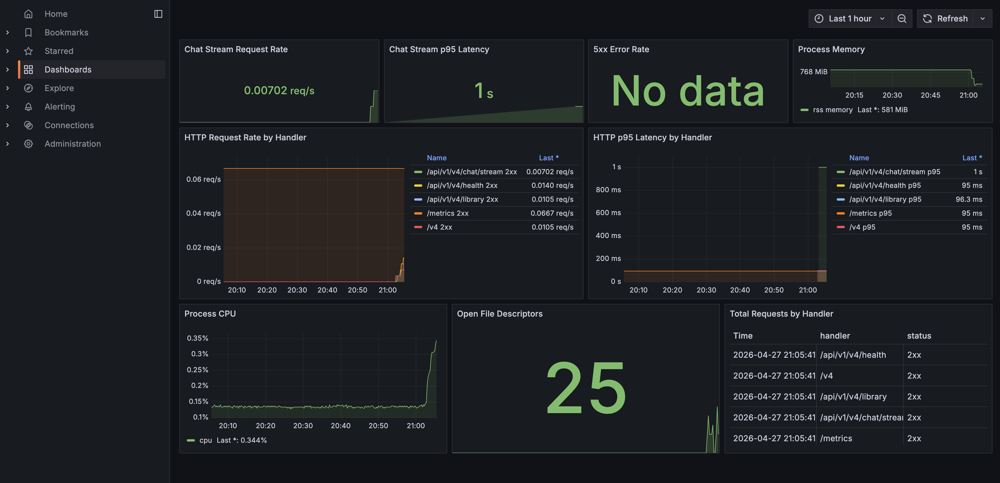

# PDF-RAG-Agent 项目文档

## 1. 项目介绍

PDF-RAG-Agent 是一个面向 Zotero 个人论文库的智能论文研究助手。它基于 FastAPI、SSE 流式对话和可视化前端，将用户问题先解析为结构化意图，再通过会话记忆、本地 PDF 语料检索、必要的 Web 搜索、证据抽取、claim 生成与 grounding 校验，最终输出带引用来源的 Markdown 回答。系统支持 PDF 文本、表格、图像/图注等多模态证据处理，默认使用 Milvus Dense 向量检索（可选 BM25/Title Anchor 多路融合），并在前端实时展示 Intent、Tool Loop、Evidence、Verification 和 PDF 预览，让论文问答从普通 RAG 升级为一个可追踪、可校验、支持多轮研究上下文的论文 Agent。

**近期重要更新（2026-05）**：基于专家架构审视，完成了 P0-P2 三级安全加固——新增引用白名单后置过滤器（citation_whitelist.py）、claim evidence-id 严格子集校验、最佳努力回答绑定污染防护、复合任务 prior_results 共享、prompt 注入防护统一包裹、LLM 输出 sanitization、模型客户端超时、target_bindings TTL 过期、以及 learnings hash 去重等 21 项修复。详见 docs/expert-review-2026-05-04.md。

## 2. 项目背景与目标

### 2.1 为什么需要这个项目

该项目是在学习了RAG技术、Agent知识等内容后，想要做一个实际有价值、能解决固定问题的Agent系统，从而锻炼自己的Agent设计能力，积累相关经验。

### 2.2 普通 PDF RAG 的问题

常见的PDF RAG方法，对于大量pdf而言，召回困难，且得到的信息生硬，并且一旦需要多次RAG才能得到答案的问题，完全无法解决。

### 2.3 想解决什么

我们的目标是实现一个智能论文研究助手。它不仅要能快速找到目标论文，还要能完成多论文比较、论文公式提取、论文图表理解、用户意图拆解、多轮上下文延续和基础自我认知。也就是说，系统不能只停留在“检索一段文本然后回答”的普通 RAG 形态，而是需要在 RAG 层面做精细设计，并配合一个成熟可用的 Agent 系统，才能完成真实论文研究场景中的复杂问题。

## 3. 系统架构总览

PDF-RAG-Agent 是一个围绕论文研究的 Agent Loop 系统。从部署视角看分为前端、API、Agent、检索、数据、模型调用六层。从代码组织看，`app/services/` 下有 16 个子包、140+ 个模块，按职责分为四组：

```
app/services/
├── 基础设施
│   └── infra/          model_clients, confidence, prompt_safety
├── 数据与检索
│   ├── library/        zotero_sqlite, metadata_sql, citation_ranking
│   ├── retrieval/      DualIndexRetriever, indexing, pdf_extractor, vector_index, web_search
│   └── memory/         session_store, learnings, artifacts, research
├── 领域逻辑（14 个子包）
│   ├── intents/        LLMIntentRouter, research, conversation, library, figure, followup, marker_matching
│   ├── planning/       research plan, query_shaping, query_rewrite, compound_tasks, solver_dispatch
│   ├── contracts/      session_context, normalization, contextual_resolver, followup_relationship
│   ├── claims/         ★ 23 modules: solver_pipeline, 13 deterministic solvers, verifiers, helpers
│   ├── answers/        entity, evidence_presentation, followup, formula, paper, topology, library_recommendations
│   ├── entities/       definition_helpers, definition_profiles, type_inference
│   ├── followup/       candidates, relationship_memory
│   ├── clarification/  intents, questions, limit_runtime
│   ├── eval/           judge (LLM-as-judge for evaluation)
│   └── tools/          dynamic_context, proposals, registry_helpers
└── Agent 编排
    ├── agent/          ★ 26 modules: core, loop, planner, runtime, chat_runtime, compound, handlers, traces
    └── agent_mixins/   answer_composer, claim_verifier, entity_definition, followup_routing, solver_pipeline
```

与前几版最大的架构变化：Agent 核心不再是一个巨大的单文件，而是拆成了 `agent/`（编排）和 `agent_mixins/`（正交能力注入）两层。领域逻辑也不在 Agent 内部耦合——`claims/`（23 个模块）、`intents/`、`planning/`、`contracts/`、`answers/` 都是独立的领域子包，Agent 通过组合它们完成推理。

### 3.1 前端层

前端层由 `app/static/index.html` 提供单页页面，包含 Zotero 论文库侧栏、聊天区、运行时 Inspector、引用来源和 PDF 预览区域。用户的问题通过普通聊天接口或 SSE 流式接口发送到 API 层，前端再根据后端返回的 `session`、`contract`、`agent_plan`、`plan`、`observation`、`agent_step`、`thinking_delta`、`tool_call`、`candidate_papers`、`screened_papers`、`evidence`、`solver_selection`、`claims`、`verification`、`reflection`、`confidence`、`answer_delta`、`heartbeat` 和 `final` 等事件实时更新界面。它的重点不是承载复杂业务逻辑，而是提升系统可观察性。

### 3.2 API 层

API 层是前端和后端之间的边界，由 `app/api/routes.py` 提供。暴露健康检查、论文库浏览、论文预览、PDF 访问、引用预览、索引重建、普通聊天、SSE 流式聊天和动态工具提案管理等接口。API 层不承担 Agent 推理，只负责接收请求、调用依赖注入得到的服务对象、处理异常并序列化响应。

### 3.3 Agent 编排层

Agent 编排层由 `agent/`（26 个模块）和 `agent_mixins/`（6 个模块）组成，是整个系统的指挥中心。

`agent/core.py` 中的 `ResearchAssistantAgent` 通过多重继承组合五个 Mixin 获得正交能力：

```python
class ResearchAssistantAgent(
    FollowupRoutingMixin,    # 追问路由：识别纠正/延续/切换
    AnswerComposerMixin,     # 答案组合：按 relation 分发到不同 answer composer
    EntityDefinitionMixin,   # 实体定义：消歧 + 定义提取
    SolverPipelineMixin,     # Claim 求解：schema / deterministic / shadow 三路径
    ClaimVerifierMixin,      # Grounding 校验：三层验证
):
```

Agent 执行一条请求的完整流程在 `chat_runtime.py` → `loop.py` 中编排：
1. `run_agent_chat_turn()` — 入口：解析 session → compress 历史 → 创建 run context → 尝试 compound → 走 standard turn
2. `run_standard_turn()` → `extract_agent_query_contract()` → `planner.plan_actions()` → `runtime.execute_*()` → solver → verifier → composer
3. `loop.py` 区分 `run_conversation_turn()` 和 `run_research_turn()` 两条路径

`agent/` 目录下的其他关键模块：
- `planner.py` — `AgentPlanner`：tool-calling / JSON / fallback 三级 plan 生成
- `runtime.py` — `AgentRuntime`：conversation 和 research 两条 tool loop 执行路径
- `tool_registries.py` — 构建 conversation (12 工具) 和 research (19 工具) 的 `RegisteredAgentTool` 字典
- `tools.py` — 20 个 `AgentToolSpec`（LLM 可见） + `AgentToolExecutor`（运行时调度）
- `research_*_handlers.py` — 四个 research 阶段的 handler：search / compose / verification / reflection
- `compound.py` — 复合查询分解（”比较 DPO 和 PPO” → 两个子任务并行）
- `task.py` — `Task` 子任务委托
- `trace.py` / `trace_diff.py` — 执行追踪与 diff

### 3.4 意图与规划层

意图与规划层由三个子包构成，负责理解用户问题并生成执行计划：

- **`intents/`（10 模块）**：`router.py` 中的 `LLMIntentRouter` 使用 tool-calling 模式做意图路由（5 个 tool choice → 20+ 种 relation）。`research.py`、`conversation.py`、`library.py`、`figure.py`、`followup.py`、`memory.py` 分别处理不同类型的意图标记和 answer slot 推断。`contract_adapter.py` 在 relation 和 answer_slots 之间做双向转换。`marker_matching.py` 提供 `MarkerProfile` 机制匹配用户问题中的关键词。

- **`planning/`（7 模块）**：`research.py` 构建 `ResearchPlan`（召回模式、证据数量、solver 顺序）；`query_shaping.py` 从问题中提取 targets；`query_rewrite.py` 做多查询改写；`compound_tasks.py` 分解复合查询；`solver_dispatch.py` 和 `solver_goals.py` 决定哪些 solver 需要执行。

- **`contracts/`（8 模块）**：`session_context.py` 构建每次 LLM 调用的会话上下文（含历史压缩）；`normalization.py` 规范化 targets；`contextual_resolver.py` 根据会话上下文消解实体引用；`conversation_memory.py` 管理跨轮次的 memory bindings；`followup_relationship.py` 处理追问关系继承。

> **关于 QueryContract**：`QueryContract` 仍然是意图解析后的核心数据结构（定义在 `domain/models.py`），但它的构建不再是单一模块的责任。`extract_agent_query_contract()` 在 `contract_extraction.py` 中组合了 router 输出、target 抽取、followup 继承、pending clarification 处理等多个来源，最后统一规范化。

### 3.5 Claim 求解与验证层

这是整个系统最庞大的领域逻辑层。`claims/` 子包有 20+ 个模块，是论文问答的核心引擎：

- **求解器（solvers）**：`solver_pipeline.py` 是总入口，调度 schema solver 和 deterministic solver。12 个 deterministic solver stage 各处理一种 relation（`formula_solver`、`figure_solver`、`table_solver`、`text_solver`、`origin_solver`、`entity_definition_solver`、`concept_definition_solver`、`followup_research_solver`、`generic_solver` 等），通过 `_DETERMINISTIC_SOLVER_REGISTRY` 注册。`deterministic_runner.py` 提供 solver 执行基础设施。
- **验证器（verifiers）**：`verifier_pipeline.py` 编排验证流程；`type_verifiers.py` 按 claim 类型做确定性校验（公式完整性、数值精确度、起源引用正确性）；`llm_verifier.py` 处理需要语义判断的复杂验证。
- **辅助模块**：`formula_text.py`、`metric_text.py`、`visual_helpers.py` 处理公式/指标/图表的文本提取；`paper_helpers.py`、`paper_summary.py` 处理论文元信息；`origin_selection.py` 处理起源论文选择。

与 claims 紧密配合的是 `answers/`（10 模块）、`entities/`（4 模块）、`followup/`（2 模块）和 `clarification/`（3 模块），它们负责将 claim 转化为最终回答、处理实体定义、管理追问候选和生成澄清问题。

### 3.6 检索与数据层

- **`retrieval/`（9 模块）**：`core.py` 中的 `DualIndexRetriever` 是在线检索核心——当前默认使用 Milvus Dense 单路召回。经过严格的消融实验（159 题 × 12 配置，详见 §11.5），`text-embedding-3-large`（3072 维）在 113 篇论文的封闭域上已达 Hit@1=95.6%，多路融合未带来增益，因此简化了默认检索路径。BM25 仍保留并修复了中文 jieba 分词；title anchor 和 relation anchor 保留为可选模块。`indexing.py` 中的 `IngestionService` 负责离线入库。`pdf_extractor.py` 基于 pypdf 做 PDF 文本和信号抽取。`vector_index.py` 封装 Milvus 向量索引。`web_search.py` 对接 Tavily API。

- **`library/`（4 模块）**：`zotero_sqlite.py` 读取 Zotero 本地 SQLite；`core.py` 提供 `LibraryBrowserService` 论文库浏览；`metadata_sql.py` 提供 SQL 查询论文库元信息（供 `query_library_metadata` 工具使用）；`citation_ranking.py` 按引用数排序论文。

- **`memory/`（4 模块）**：`session_store.py` 提供 `SQLiteSessionStore`（生产）和 `InMemorySessionStore`（测试）；`learnings.py` 管理持久化学习；`artifacts.py` 管理工具执行产物；`research.py` 管理研究记忆。

### 3.7 基础设施层

- **`infra/`（3 模块）**：`model_clients.py` 中的 `ModelClients` 统一封装 Chat（当前 `deepseek-v4-flash`）、VLM（`gpt-4.1-mini`）、Embedding（`text-embedding-3-large`，走 Qihai 网关）三个模型能力。`confidence.py` 处理置信度归一化。`prompt_safety.py` 做输入安全检查。

- **`eval/`（1 模块）**：`judge.py` 提供 LLM-as-judge 评估能力。

- **`tools/`（3 模块）**：`proposals.py` 管理动态工具提案的生命周期；`registry_helpers.py` 提供工具注册的辅助函数；`dynamic_context.py` 管理动态工具上下文。

## 4. 启动入口

### 4.1 app/main.py

`app/main.py` 是整个 FastAPI 后端的装配入口。它本身不负责论文问答、检索或 Agent 推理，而是负责把应用运行所需的几类东西串起来：读取配置、初始化日志、定义生命周期、创建 FastAPI 应用、注册 API 路由、提供 `/` 前端页面，并在依赖存在时暴露 `/metrics` 监控指标。

```python
from __future__ import annotations
from contextlib import asynccontextmanager
from pathlib import Path
from typing import AsyncIterator
```

这里首先导入了基础工具。`from __future__ import annotations` 用于延迟注解解析，`Path` 用于处理路径。`asynccontextmanager` 和 `AsyncIterator` 则与后面的 lifespan 机制有关，具体放在 4.4 再展开。

```python
from fastapi import FastAPI
from fastapi.middleware.cors import CORSMiddleware
from fastapi.responses import FileResponse, RedirectResponse
```

这里导入的是 FastAPI 应用装配相关能力。`FastAPI` 用于创建后端应用，`CORSMiddleware` 用于跨域配置，`FileResponse` 用于返回静态 HTML 或 PDF 文件，`RedirectResponse` 用于做路径跳转。

```python
try:
    from prometheus_fastapi_instrumentator import Instrumentator
except Exception:
    Instrumentator = None
```

这里是可选监控依赖的导入逻辑。如果当前环境安装了 `prometheus_fastapi_instrumentator`，后面就可以用它暴露 Prometheus metrics；如果没有安装，也不会影响主应用启动。

```python
from app.api.routes import router
from app.core.config import get_settings
from app.core.deps import close_cached_resources
from app.core.logging import setup_logging
```

这几行导入的是项目内部核心依赖。`router` 是 API 路由集合，`get_settings` 用于读取配置，`close_cached_resources` 用于应用关闭时释放缓存资源，`setup_logging` 用于初始化 JSON 日志。

```python
APP_DIR = Path(__file__).resolve().parent
STATIC_DIR = APP_DIR / "static"

settings = get_settings()
setup_logging(settings.log_level)
```

这里完成了入口文件的基础准备工作。`APP_DIR` 指向 `app` 目录，`STATIC_DIR` 指向 `app/static` 目录，后面 `/` 会从这里返回 `index.html`。`settings = get_settings()` 会读取环境变量和项目 `.env`，并确保运行时目录存在；`setup_logging(settings.log_level)` 则根据配置初始化日志。

### 4.2 FastAPI 应用创建

```python
app = FastAPI(
    title=settings.app_name,
    version="0.1.0",
    description="Tool-calling Zotero paper research agent",
    lifespan=lifespan,
)
```

这段代码真正创建了 FastAPI 应用对象。`title`、`version` 和 `description` 会出现在 OpenAPI 文档和服务元信息中。这里的 `title` 来自 `settings.app_name`，说明应用名称由配置统一管理。`lifespan=lifespan` 则把应用生命周期函数注册给 FastAPI，使服务启动和关闭时可以执行自定义逻辑。

```python
if settings.cors_allow_origins:
    app.add_middleware(
        CORSMiddleware,
        allow_origins=list(settings.cors_allow_origins),
        allow_credentials=True,
        allow_methods=["GET", "POST"],
        allow_headers=["Authorization", "Content-Type", "X-API-Key"],
    )
```

创建应用之后，代码会根据配置决定是否启用 CORS。只有当 `settings.cors_allow_origins` 不为空时，才会添加 `CORSMiddleware`。这样可以避免默认放开跨域访问，同时在需要前后端分离或跨域调试时，通过环境变量显式配置允许访问的前端来源。

### 4.3 路由与静态页面挂载

```python
app.include_router(router, prefix="/api/v1")
```

这句把 `app/api/routes.py` 中定义的 API 路由统一挂载到 `/api/v1` 前缀下面。也就是说，路由文件里定义的 `/chat`、`/health` 等接口，最终会变成 `/api/v1/chat`、`/api/v1/health`。其中 `/api/v1` 是 接口协议版本，`/v4` 则对应当前 PDF-RAG-Agent V4 这套业务版本。

```python
@app.get("/", include_in_schema=False)
def root() -> FileResponse:
    return FileResponse(STATIC_DIR / "index.html", headers={"Cache-Control": "no-store"})
```

根路径 `/` 直接返回前端单页应用。浏览器拿到这个页面后，会执行其中的 JavaScript，再去请求 `/api/v1/chat/stream`、`/api/v1/library` 等后端接口。这里设置 `Cache-Control: no-store` 是为了避免浏览器缓存旧版前端页面。

```python
@app.get("/v4", include_in_schema=False)
def v4_ui() -> FileResponse:
    return FileResponse(
        STATIC_DIR / "index.html",
        headers={
            "Cache-Control": "no-store, no-cache, must-revalidate, max-age=0",
            "Pragma": "no-cache",
            "Expires": "0",
        },
    )


@app.get("/v5", include_in_schema=False)
def v5_ui() -> FileResponse:
    return FileResponse(
        STATIC_DIR / "index.html",
        headers={
            "Cache-Control": "no-store, no-cache, must-revalidate, max-age=0",
            "Pragma": "no-cache",
            "Expires": "0",
        },
    )
```

`/v4` 和 `/v5` 返回的是同一个静态 HTML 页面，也就是 `app/static/index.html`。浏览器拿到这个页面后，会执行其中的 JavaScript，再去请求 `/api/v1/chat/stream`、`/api/v1/library` 等后端接口。这里设置 `Cache-Control: no-store` 是为了避免浏览器缓存旧版前端页面，方便前端持续迭代和线上刷新。两个路径并存是为了兼容不同版本的前端入口（`/v4` 和 `/v5` 指向同一个最新前端页面，）。

### 4.4 lifespan 资源释放

```python
@asynccontextmanager
async def lifespan(_: FastAPI) -> AsyncIterator[None]:
    try:
        yield
    finally:
        await close_cached_resources()
```

这里，`asynccontextmanager` 是一个装饰器，用来把带有 `yield` 的异步函数变成异步上下文管理器。它用一种简单的方式表达了应用启动时进入、应用运行中停在 `yield`、应用关闭时执行 `finally`。FastAPI 在实例化时接收 `lifespan=lifespan`，就能自动识别启动和关闭时要执行的逻辑。它近似做了这件事：

```python
cm = lifespan(app)

await cm.__aenter__()   # 执行 yield 前面的代码
try:
    await run_server()  # 应用运行中
finally:
    await cm.__aexit__()  # 继续执行 yield 后面和 finally
```

当前项目没有在启动阶段额外初始化重资源，所以直接 `yield` 提供服务。运行阶段由 FastAPI 处理各种请求；关闭阶段执行 `finally`，调用 `close_cached_resources()` 释放模型客户端、Retriever、HTTP 连接池等缓存资源。

### 4.5 Prometheus metrics

```python
if Instrumentator is not None:
    Instrumentator(
        should_group_status_codes=True,
        should_ignore_untemplated=True,
    ).instrument(app).expose(app, include_in_schema=False, endpoint="/metrics")
```

如果 `prometheus_fastapi_instrumentator` 成功导入，应用就会暴露 `/metrics` 运维观测入口。Prometheus 会定时抓取这个接口并存储指标，Grafana 再读取 Prometheus 数据并画图。当前项目的基础 metrics 包括 HTTP 请求数、响应状态码、接口耗时、Python GC、进程内存、CPU 和文件描述符等。



从监控面板上可以看出几类信息。流量方面，`Chat Stream Request Rate = 0.00702 req/s`，表示最近五分钟平均每秒请求数；`HTTP Request Rate by Handler` 中 `/metrics` 最高，这是因为 Prometheus 每 15 秒抓一次，`1 / 15 = 0.0667 req/s`。延迟方面，`Chat Stream p95 Latency = 1s`，表明 95% 的 `/chat/stream` 请求耗时不超过约 1 秒；不过这个指标来自 FastAPI HTTP 层，对于 SSE 流式接口来说，它不完全等价于用户感知的首 token 延迟。错误方面，`5xx Error Rate = No data` 通常表示最近没有出现 5xx 错误。资源方面，内存如果长期持续上涨不下降就要怀疑泄漏；CPU 当前很低，说明服务基本空闲；Open File Descriptors 也很低，说明没有明显连接泄漏或文件句柄泄漏。


## 5. API 路由

API 路由层主要集中在 app/api/routes.py，负责把 FastAPI 的 HTTP 请求转换为对后端服务层和 Agent 层的调用。它通过 APIRouter 定义 API 接口，并在 main.py 中统一挂载到 /api/v1 前缀下。该层不直接实现复杂业务逻辑，而是负责参数接收、依赖注入、权限校验、异常转换、响应模型封装和 SSE 流式事件输出，是前端与后端核心能力之间的边界层。

这里，我们先用 `app.schemas.api` 中定义的一系列Schema，来规范返回的格式。

```python
from app.schemas.api import (
    AgentChatRequest,
    AgentChatResponse,
    AgentCitation,
    CitationPreviewResponse,
    HealthResponse,
    IngestRequest,
    IngestResponse,
    LibraryResponse,
    PaperPreviewResponse,
)
```

### 5.1 health

`health` 是最简单的状态检查接口，用来判断后端服务是否已经正常启动，并让前端确认当前加载的是新版运行时。

```python
@router.get("/health", response_model=HealthResponse)
def health() -> HealthResponse:
    return HealthResponse()
```

这个接口没有请求参数，也不会触发 Agent、检索器或模型调用，只是直接返回一个 `HealthResponse`。由于 `routes.py` 中的路由会在 `main.py` 里统一挂载到 `/api/v1` 前缀下，所以它的真实访问路径是 `/api/v1/health`。前端启动时会请求这个接口，用返回值判断服务是否在线、当前 runtime 是否支持结构化摘要，以及后端暴露的 canonical tools 是否为 `read_memory`、`search_corpus`、`web_search`、`query_library_metadata`、`compose`、`ask_human`。

```python
class HealthResponse(BaseModel):
    status: str = "ok"
    runtime_profile: str = "structured-intent-react-loop"
    runtime_summary_supported: bool = True
    canonical_tools: list[str] = Field(
        default_factory=lambda: ["read_memory", "search_corpus", "web_search", "query_library_metadata", "compose", "ask_human"]
    )
```

### 5.2 library

`library` 接口用于返回当前论文库的整体列表，是前端左侧 Zotero Corpus 侧栏的数据来源。

```python
@router.get("/library", response_model=LibraryResponse)
def library(
    library_service: LibraryBrowserService = Depends(get_library_service),
) -> LibraryResponse:
    return LibraryResponse(**library_service.list_library())
```

这个接口通过 `Depends(get_library_service)` 获取 `LibraryBrowserService` 实例。`Depends` 是 FastAPI 的依赖注入机制，意思是请求进入这个接口时，FastAPI 会先调用 `get_library_service()`，把返回的服务对象传给 `library_service` 参数。真正读取论文库、整理分类、生成论文列表的逻辑不写在路由层，而是交给 `library_service.list_library()` 完成。

接口返回值被声明为 `LibraryResponse`，LibraryResponse 是论文库接口的最外层响应，表示“整个论文库浏览结果”。它里面有一个 categories，类型是 list[LibraryCategory]，表示按 Zotero collection、标签或“未分类”分组后的论文列表；还有一个 total_papers，表示当前论文库里去重后的论文总数。LibraryCategory 表示一个分类分组，name 是分类名，count 是这个分类下有多少篇论文，papers 是该分类下的论文列表。最里面的 LibraryPaper 是前端论文卡片需要的最小展示单元，包含 paper_id、title、authors、year、tags、categories、file_path、preview 等字段。

### 5.3 paper preview / pdf

这一节对应两个论文预览相关接口：一个返回论文的结构化预览信息，另一个返回真实 PDF 文件。

```python
@router.get("/library/papers/{paper_id}/preview", response_model=PaperPreviewResponse)
def paper_preview(
    paper_id: str,
    library_service: LibraryBrowserService = Depends(get_library_service),
) -> PaperPreviewResponse:
    payload = library_service.paper_preview(paper_id)
    if payload is None:
        raise HTTPException(status_code=404, detail="paper not found")
    return PaperPreviewResponse(**payload)
```

`paper_preview` 用于根据 `paper_id` 返回某篇论文的预览信息。这里的 `paper_id` 来自 URL 路径，例如 `/api/v1/library/papers/xxx/preview`。路由层会调用 `library_service.paper_preview(paper_id)`，如果找不到对应论文，就抛出 `404 paper not found`；如果找到，就包装成 `PaperPreviewResponse` 返回。这个响应里包含论文基础信息和若干证据片段，供前端右侧 Preview 面板展示。

```python
@router.get("/library/papers/{paper_id}/pdf")
def paper_pdf(
    paper_id: str,
    _: None = Depends(require_pdf_access),
    library_service: LibraryBrowserService = Depends(get_library_service),
) -> FileResponse:
    path = library_service.pdf_path(paper_id)
    if path is None:
        raise HTTPException(status_code=404, detail="pdf not found")
    return FileResponse(path, media_type="application/pdf", filename=path.name, content_disposition_type="inline")
```

`paper_pdf` 用于返回某篇论文的 PDF 文件。这个接口比 preview 更敏感，因为它会直接把 Zotero 本地 PDF 文件发给浏览器，所以这里增加了 `Depends(require_pdf_access)` 做访问控制。`library_service.pdf_path(paper_id)` 会解析并校验 PDF 路径，如果文件不存在、不是 PDF，或者不在允许的 Zotero 路径范围内，就返回 `None`，接口再抛出 `404 pdf not found`。成功时，`FileResponse` 会以 `application/pdf` 类型返回文件，并通过 `content_disposition_type="inline"` 让浏览器尽量以内嵌预览方式打开，而不是直接下载。

### 5.4 citation preview

`citation preview` 用于根据回答中的引用信息，反查对应的证据片段，给前端的引用预览面板使用。

```python
@router.get("/citations/preview", response_model=CitationPreviewResponse)
def citation_preview(
    doc_id: str = Query(default=""),
    paper_id: str = Query(default=""),
    library_service: LibraryBrowserService = Depends(get_library_service),
) -> CitationPreviewResponse:
    payload = library_service.citation_preview(doc_id=doc_id, paper_id=paper_id)
    if payload is None:
        raise HTTPException(status_code=404, detail="citation evidence not found")
    return CitationPreviewResponse(**payload)
```

这个接口和前面的论文预览不同，它不是按路径参数接收 `paper_id`，而是通过 query 参数接收 `doc_id` 和 `paper_id`，真实访问形式类似 `/api/v1/citations/preview?doc_id=xxx&paper_id=yyy`。其中 `doc_id` 更精确，指向某一个 evidence block；`paper_id` 更粗，指向某一篇论文。服务层会优先用 `doc_id` 找 block 级证据，如果找不到，再尝试用 `paper_id` 找论文级信息。

```python
class CitationPreviewResponse(BaseModel):
    paper_id: str = ""
    doc_id: str = ""
    title: str = ""
    authors: str = ""
    year: str = ""
    file_path: str = ""
    page: int = 0
    block_type: str = ""
    caption: str = ""
    snippet: str = ""
```

返回结果里既包含论文元信息，也包含页码、块类型、图注和证据片段。这样前端在用户点击回答里的引用时，不需要重新跑 Agent，也不需要重新检索，只要拿着引用里的 `doc_id` 或 `paper_id` 调这个接口，就能展示对应来源。换句话说，`citation preview` 是“回答引用”到“原始证据”的轻量跳转接口，它主要服务于可追踪性和结果校验。

### 5.5 ingest rebuild

`ingest rebuild` 是索引重建接口，用来把 Zotero 论文库重新抽取、切块、入库，并更新本地检索索引。

```python
@router.post("/ingest/rebuild", response_model=IngestResponse)
def ingest_rebuild(
    payload: IngestRequest,
    _: None = Depends(require_admin_access),
    ingestion_service: IngestionService = Depends(get_ingestion_service),
) -> IngestResponse:
    try:
        stats = ingestion_service.rebuild(max_papers=payload.max_papers, force_rebuild=payload.force_rebuild)
        get_retriever().refresh()
    except Exception as exc:
        logger.exception("v4 ingest rebuild failed")
        raise HTTPException(status_code=500, detail="ingest rebuild failed") from exc
    return IngestResponse(message="v4 ingestion completed", **stats.to_dict())
```

这个接口是 `POST` 请求，因为它会改变系统状态。它不是给普通用户频繁点击的问答接口，而是管理员在新增论文、修改 Zotero 库、重建向量索引时使用的维护接口。所以参数中有 `Depends(require_admin_access)`，请求必须带正确的 admin API key，否则会返回 401；如果服务端没有配置 `ADMIN_API_KEY`，则会返回 503，避免危险接口在无保护状态下暴露。

```python
class IngestRequest(BaseModel):
    force_rebuild: bool = True
    max_papers: int | None = Field(default=None, ge=1)

class IngestResponse(BaseModel):
    message: str
    paper_records: int = 0
    papers_indexed: int = 0
    papers_missing_pdf: int = 0
    block_docs: int = 0
    paper_docs: int = 0
    vectors_upserted: int = 0
    papers_with_generated_summary: int = 0
```

`max_papers` 用于限制本次最多处理多少篇论文，适合调试或小规模验证；`force_rebuild` 会传给向量索引层，如果为 true，会重建 Milvus collection 后再写入向量。返回值里的 `paper_records` 表示从 Zotero 读取到的记录数，`papers_indexed` 表示成功完成 PDF 抽取并入库的论文数，`papers_missing_pdf` 表示 Zotero 里有记录但本地 PDF 缺失的数量，`paper_docs` 是论文级索引文档数，`block_docs` 是 PDF 页面、段落、表格、图注等证据块文档数，`vectors_upserted` 是写入 Milvus 的向量数量。

它的完整链路是：路由层接收请求并校验管理员权限，`IngestionService.rebuild()` 读取 Zotero 记录，调用 PDF 抽取器解析页面内容，生成 paper card 和 block documents，写入 `v4_papers.jsonl`、`v4_blocks.jsonl` 和 ingestion state；如果配置了 embedding 所需的 API key，还会把论文级文档和证据块文档写入 Milvus。最后，路由层调用 `get_retriever().refresh()`，让正在运行的服务重新加载本地 JSONL 和 BM25 索引，这样重建完成后前端查询可以立即使用新论文库。

### 5.6 chat / stream chat

`chat` 和 `chat/stream` 是前端真正发起论文问答的两个入口。它们使用同一个请求模型 `AgentChatRequest`，区别在于返回方式不同：`chat` 等 Agent 全部运行结束后一次性返回完整 JSON；`chat/stream` 则通过 SSE 把运行事件和回答增量实时推给前端。

```python
class AgentChatRequest(BaseModel):
    query: str = Field(min_length=1)
    session_id: str | None = None
    use_web_search: bool = False
    max_web_results: int = Field(default=3, ge=1, le=10)
    clarification_choice: dict[str, Any] | None = None
```

这里的 `query` 是用户输入的问题，`session_id` 用于延续多轮对话，`use_web_search` 控制是否允许补充 Web Search，`max_web_results` 限制网页搜索数量，`clarification_choice` 用于处理上一轮 Agent 反问用户后的选择结果。Agent 始终以 auto 模式运行，自动判断对话或研究任务。

```python
@router.post("/chat", response_model=AgentChatResponse)
async def agent_chat_v4(
    payload: AgentChatRequest,
    agent: ResearchAssistantAgent = Depends(get_agent),
) -> AgentChatResponse:
    try:
        result = await agent.achat(
            query=payload.query,
            session_id=payload.session_id,
            mode=payload.mode,
            use_web_search=payload.use_web_search,
            max_web_results=payload.max_web_results,
            clarification_choice=payload.clarification_choice,
        )
    except Exception as exc:
        logger.exception("v4 chat failed")
        raise HTTPException(status_code=500, detail="chat failed") from exc
```

普通 `chat` 接口通过 `Depends(get_agent)` 拿到全局缓存的 `ResearchAssistantAgent`，然后调用 `agent.achat()`。虽然路由函数是 async，但 Agent 内部主要是同步的检索、规划和模型调用，所以 `achat()` 实际上会用 `asyncio.to_thread()` 把同步 `chat()` 放到线程里执行，避免长时间阻塞 FastAPI 的事件循环。接口如果执行失败，会记录异常日志，并统一返回 `500 chat failed`。

```python
citation_models = [AgentCitation(**item) for item in result.get("citations", [])]
return AgentChatResponse(
    session_id=str(result.get("session_id", "")),
    interaction_mode=str(result.get("interaction_mode", "")),
    answer=str(result.get("answer", "")),
    citations=citation_models,
    query_contract=dict(result.get("query_contract", {})),
    research_plan_summary=dict(result.get("research_plan_summary", {})),
    runtime_summary=dict(result.get("runtime_summary", {})),
    execution_steps=list(result.get("execution_steps", [])),
    verification_report=dict(result.get("verification_report", {})),
    needs_human=bool(result.get("needs_human", False)),
    clarification_question=str(result.get("clarification_question", "")),
    clarification_options=list(result.get("clarification_options", [])),
)
```

这里可以看到，`chat` 的返回不只是最终答案，还包括引用、结构化意图、研究计划摘要、运行时摘要、执行步骤、验证报告和澄清信息。因此它更像是一次完整 Agent 运行结果的快照，适合调试、测试或不需要实时流式展示的调用场景。

```python
@router.post("/chat/stream")
async def agent_chat_v4_stream(
    payload: AgentChatRequest,
    agent: ResearchAssistantAgent = Depends(get_agent),
) -> StreamingResponse:
    async def event_stream() -> object:
        try:
            async for item in agent.astream_chat_events(
                query=payload.query,
                session_id=payload.session_id,
                mode=payload.mode,
                use_web_search=payload.use_web_search,
                max_web_results=payload.max_web_results,
                clarification_choice=payload.clarification_choice,
            ):
                yield _format_sse(str(item.get("event", "message")), item.get("data", {}))
        except Exception as exc:
            logger.exception("v4 stream failed")
            for event, data in _stream_error_events(exc):
                yield _format_sse(event, data)
```

`chat/stream` 是前端主要使用的接口。它没有声明 `response_model`，因为它返回的不是一个普通 JSON，而是一条持续输出的事件流。`event_stream()` 是一个异步生成器，会不断从 `agent.astream_chat_events()` 里拿事件，再用 `_format_sse()` 转成 SSE 格式。SSE 的基本格式是 `event: 事件名` 加 `data: JSON字符串`，中间用空行分隔，浏览器可以边接收边渲染。

```python
def _format_sse(event: str, data: object) -> str:
    return f"event: {event}\ndata: {json.dumps(data, ensure_ascii=False)}\n\n"
```

Agent 在运行过程中会不断产生 `session`、`contract`、`agent_plan`、`plan`、`observation`、`agent_step`、`thinking_delta`、`tool_call`、`candidate_papers`、`screened_papers`、`evidence`、`solver_selection`、`claims`、`verification`、`reflection`、`confidence`、`answer_delta`、`heartbeat`、`final` 等事件。前端收到这些事件后，就能实时更新 Runtime 面板、引用列表和回答正文。最新的 LLM-judge 候选消歧也会通过 `observation` 暴露出来，例如 `summary=options=4, judge=auto_resolve, confidence=0.95`。相比普通 `chat`，`chat/stream` 的价值在于可观察性更强，用户不用等完整答案生成完，前端也能展示 Agent 正在理解问题、调用工具、检索证据、消解候选并组合答案的过程。

```python
return StreamingResponse(
    event_stream(),
    media_type="text/event-stream",
    headers={
        "Cache-Control": "no-cache",
        "Connection": "keep-alive",
        "X-Accel-Buffering": "no",
    },
)
```

最后返回的 `StreamingResponse` 指定了 `text/event-stream`，这是 SSE 的标准媒体类型。`Cache-Control: no-cache` 避免中间层缓存流式结果，`Connection: keep-alive` 保持连接不断开，`X-Accel-Buffering: no` 则是给 Nginx 的提示，避免反向代理把事件攒在一起后再一次性返回。这个接口本质上就是把 Agent 内部运行轨迹包装成浏览器可以消费的实时事件流。


流式返回的总链路：用户点击发送
-> fetch POST /api/v1/chat/stream
-> FastAPI StreamingResponse 打开长连接
-> Agent 在线程里执行 run_agent_chat_turn()
-> 执行过程中 emit_event(item) 把事件放入 asyncio.Queue
-> astream_chat_events() 从 queue 取事件并 yield
-> routes.py 转成 SSE 文本
-> 浏览器 reader.read() 持续读取
-> parseSse() 解析 event/data
-> answer_delta 追加回答，final 收尾


### 5.7 动态工具提案管理 API

这是一组管理员接口，用于管理动态注册的 Agent 工具提案，支持从提案创建、沙盒测试到正式启用的完整生命周期。

```python
@router.get("/admin/tools/proposals")
def admin_list_tool_proposals(
    include_code: bool = Query(default=False),
    _: None = Depends(require_admin_access),
    settings: Settings = Depends(get_settings),
) -> dict[str, object]:
    return {"items": list_tool_proposals(data_dir=settings.data_dir, include_code=include_code)}
```

`GET /admin/tools/proposals` 列出所有工具提案，可选参数 `include_code` 控制是否返回提案中的 Python 代码。

```python
@router.get("/admin/tools/proposals/{proposal_id}")
def admin_get_tool_proposal(proposal_id: str, ...) -> dict[str, object]:
    return load_tool_proposal(data_dir=settings.data_dir, proposal_id=proposal_id, include_code=include_code)
```

`GET /admin/tools/proposals/{proposal_id}` 获取单个工具提案的完整内容，包括代码和元信息。

```python
@router.post("/admin/tools/proposals/{proposal_id}/sandbox")
def admin_run_tool_proposal_sandbox(proposal_id: str, payload: ToolProposalSandboxRequest, ...):
    return run_tool_proposal_sandbox(
        proposal_path=proposal_path,
        args=payload.args,
        timeout_seconds=payload.timeout_seconds,
        memory_limit_mb=payload.memory_limit_mb,
    )
```

`POST /admin/tools/proposals/{proposal_id}/sandbox` 在沙盒环境中执行工具提案代码，验证其功能是否正常。`ToolProposalSandboxRequest` 包含 `args`（工具参数）、`timeout_seconds`（超时限制，最大 30s）和 `memory_limit_mb`（内存限制，64-2048 MB）。

```python
@router.post("/admin/tools/proposals/{proposal_id}/status")
def admin_transition_tool_proposal_status(proposal_id: str, payload: ToolProposalTransitionRequest, ...):
    return transition_tool_proposal_status(
        proposal_path=proposal_path,
        next_status=payload.next_status,
        code_sha256=payload.code_sha256,
        reviewer=payload.reviewer,
        note=payload.note,
        sandbox_report=payload.sandbox_report,
    )
```

`POST /admin/tools/proposals/{proposal_id}/status` 切换工具提案的状态（如 `draft` → `sandboxed` → `active` 或 `deprecated`）。`ToolProposalTransitionRequest` 包含 `next_status`（下一状态）、`code_sha256`（代码哈希用于校验完整性）、`reviewer`（审核人）、`note`（备注）和 `sandbox_report`（沙盒测试报告）。

所有工具提案接口都需要通过 `require_admin_access` 校验管理员身份，与 `ingest rebuild` 一样的安全控制。


## 6. 数据模型

### 6.1 API schema

`app.schemas.api` 里的 `BaseModel` 负责规定前端和后端之间的数据格式。它们更像 HTTP 边界上的“合同”：前端传进来的请求必须满足请求 schema，后端返回给前端的数据也要满足响应 schema。比如 `AgentChatRequest` 约束了 `query` 不能为空，`max_web_results` 必须在 1 到 10 之间；`AgentChatResponse` 则规定了一次问答最终要返回 `answer`、`citations`、`query_contract`、`runtime_summary`、`verification_report` 和澄清相关字段。

如果请求不满足 schema，FastAPI 会在进入路由函数之前返回 `422`。如果后端构造出来的响应不满足 `response_model` 或手动实例化的 Pydantic schema，就说明后端实现违反了自己的接口合同，通常会变成服务端异常。也就是说，API schema 的价值不只是“写注解”，而是把前后端交互格式固定下来，让错误尽早暴露。

### 6.2 domain models

这是更靠近 Agent 内部推理的数据结构，比如 `QueryContract`、`SessionContext`、`ResearchPlan`、`CandidatePaper`、`DisambiguationJudgeDecision`、`EvidenceBlock`、`Claim`、`VerificationReport`、`AssistantCitation`、`AssistantResponse` 等。它们不是给前端页面直接展示用的，而是 Agent 在理解问题、规划检索、筛选论文、消解歧义、抽取证据、生成 claim、做 grounding 校验和组织最终答案时使用的内部协议。

用一句话概括：API schema 是后端对前端说话的格式，domain models 是 Agent 内部思考和协作的格式。没有这些结构，系统就会退化成到处传 `dict`，每个模块都靠记忆猜字段名，很容易出现 `target`、`targets`、`paper_titles`、`active_titles` 混用的问题。

当前研究链路可以概括为：

```txt
用户问题
-> AgentChatRequest：API 接收用户请求
-> QueryContract：把自然语言问题变成结构化研究意图
-> ResearchPlan：决定召回方式、证据数量和 solver 顺序
-> CandidatePaper：论文级候选
-> DisambiguationJudgeDecision：在候选有歧义时判断是否可自动绑定
-> EvidenceBlock：具体证据块
-> Claim：基于证据提炼出的结论
-> VerificationReport：检查 claim 是否被证据支持，是否需要 retry 或澄清
-> AssistantResponse：最终回答、引用、运行摘要和澄清信息
-> SessionContext / SessionTurn：把本轮研究写入多轮记忆
```

### 6.3 QueryContract

`QueryContract` 是用户问题进入 Agent 后最关键的结构化意图对象。它把一句自然语言问题拆成后续模块可以执行的字段，例如 `relation` 表示问题类型，`targets` 表示目标实体或论文，`requested_fields` 表示需要回答哪些信息，`required_modalities` 表示需要什么证据类型，`answer_shape` 表示答案形态，`precision_requirement` 表示精确度要求。

以最新真实 trace 中的 DPO 查询为例，用户输入是 `帮我看看 DPO 这篇论文的核心公式`，系统得到的核心 contract 是：

```json
{
  "clean_query": "帮我看看 DPO 这篇论文的核心公式",
  "interaction_mode": "research",
  "relation": "formula_lookup",
  "targets": ["DPO"],
  "answer_slots": ["formula"],
  "requested_fields": ["formula", "variable_explanation", "source"],
  "required_modalities": ["page_text", "table"],
  "answer_shape": "bullets",
  "precision_requirement": "exact",
  "continuation_mode": "fresh",
  "allow_web_search": false
}
```

这里的 `relation=formula_lookup` 决定了后续会走公式相关的检索和 solver；`requested_fields` 要求答案必须包含公式、变量解释和来源；`precision_requirement=exact` 表示系统不能只给概念性总结，而要尽量找到原文中的数学表达式。

`notes` 是 `QueryContract` 里的扩展记录区，用于保存结构化意图之外的运行痕迹。最新 LLM-judge 自动消歧后，真实 `notes` 中会出现 `auto_resolved_by_llm_judge`、`selected_paper_id=S6H9FE28`、`disambiguation_judge_confidence=0.950` 和 `disambiguation_judge_reason=...`，说明系统不是让用户手动选择，而是在高置信度条件下自动绑定到了 DPO 原论文。

### 6.4 SessionContext

`SessionContext` 负责保存多轮对话状态。它包含当前会话的 `session_id`、最近研究主题、active research、历史 turn、工作记忆和 pending clarification 等信息。比如用户上一轮刚问过 DPO，下一轮追问“那这个公式里的 beta 是什么”，系统就需要通过 `SessionContext` 知道“这个公式”指的是 DPO 论文中的公式，而不是重新把问题当成一个全新任务。

这个模型里有一些 legacy 字段，例如 `active_targets`、`active_titles`、`active_research_relation` 等，同时也有新的 `active_research` 对象。`sync_active_research_compatibility()` 的作用就是在旧字段和新结构之间做兼容同步，这是项目多次重构后留下的真实工程痕迹。

在旧机制里，DPO 歧义会写入 `pending_clarification_options`，然后等待用户下一轮选择。现在加入 LLM-judge 后，如果 judge 给出高置信度自动绑定，系统就不会进入 `needs_human=true`；如果 judge 不够确定，仍然会保留人工澄清路径，并把推荐候选标记为 `judge_recommended`。

### 6.5 ResearchPlan

`ResearchPlan` 是 Agent 对“怎么查”的计划。它不关心最终回答怎么写，而是规定论文召回模式、候选数量、证据数量、solver 顺序和 retry 预算。

```python
class ResearchPlan(BaseModel):
    paper_recall_mode: Literal["anchor_first", "broad", "broad_then_anchor"] = "broad"
    paper_limit: int = 6
    evidence_limit: int = 14
    solver_sequence: list[str] = Field(default_factory=list)
    required_claims: list[str] = Field(default_factory=list)
    retry_budget: int = 1
```

DPO 公式查询的真实计划是 `paper_recall_mode=anchor_first`、`paper_limit=6`、`evidence_limit=24`、`solver_sequence=["formula_solver", "table_solver"]`、`required_claims=["formula", "variable_explanation"]`。这说明系统会先围绕 DPO 这个 anchor 找论文，再在选中论文里扩展更多公式/表格相关证据。

### 6.6 CandidatePaper / DisambiguationJudgeDecision

`CandidatePaper` 是论文级候选，表示“系统认为可能相关的一篇论文”。它包含 `paper_id`、`title`、`year`、`score`、`match_reason`、`anchor_terms`、`doc_ids` 和原始 metadata。对于 DPO 这类缩写问题，单纯召回候选还不够，因为本地库里可能有很多论文都提到了 DPO。

最新加入的 `DisambiguationJudgeDecision` 就是为了解决这个问题。它是 LLM-judge 的结构化输出：

```python
class DisambiguationRejectedOption(BaseModel):
    option_id: str = ""
    reason: str = ""

class DisambiguationJudgeDecision(BaseModel):
    decision: Literal["auto_resolve", "ask_human"] = "ask_human"
    selected_option_id: str | None = None
    selected_paper_id: str | None = None
    confidence: float = Field(default=0.0, ge=0.0, le=1.0)
    reason: str = ""
    rejected_options: list[DisambiguationRejectedOption] = Field(default_factory=list)
```

这一步发生在 `_agent_solve_claims()` 中。系统先根据 evidence 生成多个 ambiguity options，再调用 `_judge_disambiguation_options()`，让模型根据用户 query、QueryContract、候选 title、snippet、paper summary 和 ranking signals 判断哪个候选最符合用户真实意图。

这里有两个阈值很重要：`DISAMBIGUATION_AUTO_RESOLVE_THRESHOLD = 0.85`，只有 judge 决策为 `auto_resolve` 且置信度不低于 0.85，系统才会自动绑定候选；`DISAMBIGUATION_RECOMMEND_THRESHOLD = 0.65`，如果置信度在推荐区间，系统只会把候选置顶并标记 `judge_recommended`，仍然让用户确认。这样既减少了显然可判断场景下的打断，也保留了低置信度情况下的人工兜底。

### 6.7 Evidence / Claim / Verification / Citation

`EvidenceBlock` 是证据块，负责保存证据来自哪篇论文、哪一页、哪种 block、具体片段是什么。它让回答可以追溯到 PDF 页面，也让 citation preview 和 PDF preview 有了可定位的信息。

`Claim` 是从 evidence 中抽取出来的结论单元。比如公式查询中，claim 会保存公式文本、变量解释、证据 ids、paper ids 和置信度。这样答案生成不是直接从一堆文本片段自由发挥，而是先形成可检查的结构化结论。

`VerificationReport` 是 grounding 校验结果。它用 `status=pass|retry|clarify` 表示当前 claim 是否足够可靠，`missing_fields` 表示缺什么，`unsupported_claims` 表示哪些结论没有证据支持，`recommended_action` 表示下一步应该 retry、澄清还是继续回答。

`AssistantCitation` 和 `AssistantResponse` 是 Agent 内部最终返回对象。`AssistantResponse` 里不只有 `answer`，还包括 `citations`、`query_contract`、`research_plan_summary`、`runtime_summary`、`execution_steps`、`verification_report`、`needs_human` 和澄清字段。API 层随后再把它包装成 `AgentChatResponse` 返回给前端。

### 6.8 真实流转案例

以下是 2026-05-02 的真实 DPO 公式查询 SSE 流式 trace，完整原始文件保存在 `docs/dpo_real_trace_20260502.txt`。请求：

```json
{
  "query": "帮我看看 DPO 这篇论文的核心公式",
  "mode": "auto",
  "use_web_search": false,
  "max_web_results": 3,
  "session_id": "dpo-real-trace-20260502-010824"
}
```

本次流式响应共 60 个 SSE 事件，事件类型分布：`answer_delta: 21`, `observation: 10`, `thinking_delta: 6`, `tool_call: 5`, `agent_step: 3`, `screened_papers: 2`, `evidence: 2`, 以及 `session`, `contract`, `agent_plan`, `plan`, `candidate_papers`, `solver_selection`, `claims`, `reflection`, `verification`, `confidence`, `final` 各 1 个。

**关键事件快照：**

[event #1] `session` — 生成 session_id=`dpo-real-trace-20260502-010824`

[event #2] `contract` — LLMIntentRouter 输出的结构化意图：
```json
{
  "clean_query": "帮我看看 DPO 这篇论文的核心公式",
  "interaction_mode": "research",
  "relation": "formula_lookup",
  "targets": ["DPO", "Direct Preference Optimization"],
  "answer_slots": ["formula"],
  "requested_fields": ["formula", "variable_explanation", "source"],
  "required_modalities": ["page_text", "table"],
  "answer_shape": "bullets",
  "precision_requirement": "exact",
  "continuation_mode": "fresh",
  "allow_web_search": false,
  "notes": ["structured_intent", "llm_tool_router", "intent_confidence=0.90",
            "router_action=need_corpus_search", "router_confidence=0.90", ...]
}
```

[event #3] `agent_plan` — AgentPlanner 的初始计划：
```json
{
  "thought": "Use tools through the agent loop, observe the result, then compose or ask for clarification.",
  "actions": ["search_corpus"],
  "tool_call_args": [{"name": "search_corpus", "args": {"query": "DPO Direct Preference Optimization core formula...", "scope": "auto", "top_k": 8}}]
}
```

[event #4] `plan` — ResearchPlan：
```json
{"paper_recall_mode": "anchor_first", "paper_limit": 6, "evidence_limit": 24,
 "solver_sequence": ["formula_solver"], "required_claims": ["formula", "variable_explanation"], "retry_budget": 1}
```

[tool loop] 执行序列共 15 个 execution steps：
1. `query_contract_extractor` → formula_lookup
2. `agent_planner` → search_corpus
3. `agent_tool:build_research_plan` → formula_solver（内置工具，不暴露给 LLM planner）
4. `agent_loop` → search_corpus
5. `agent_tool:search_corpus` → candidates=6, selected=1
6. `agent_tool:search_corpus` → evidence=6（第一轮证据块）
7. `agent_tool:search_corpus` → papers=1, evidence=6（筛选后）
8. `agent_tool:read_memory` → turns=0（检查会话历史）
9. `agent_tool:compose` → **options=4, judge=auto_resolve, confidence=0.95**
10. `agent_tool:compose` → claim_solver=deterministic
11. `agent_tool:compose` → claims=1
12. `agent_tool:verify_claim` → pass
13. `agent_tool:compose` → pass
14. `agent_reflection` → pass
15. `agent_tool:verify_claim` → pass

[LLM-judge 消歧] 第 9 步 `observation` 事件中的真实决策：
```json
{
  "tool": "compose",
  "summary": "options=4, judge=auto_resolve, confidence=0.95",
  "payload": {
    "judge_decision": {
      "decision": "auto_resolve",
      "selected_option_id": "acronym-meaning-dpo-...",
      "selected_paper_id": "S6H9FE28",
      "confidence": 0.95,
      "reason": "The query explicitly asks for the core formula of 'DPO,' and the candidate titled 'Direct Preference Optimization: Your Language Model is Secretly a Reward Model' directly defines and originates the concept of DPO."
    }
  }
}
```

[event #60] `final` — 最终答案：
- `interaction_mode`: research
- `answer`: 574 字符，含 LaTeX 公式 $$\mathcal{L}_{\mathrm{DPO}} = -\log \sigma\left( \beta \log \frac{\pi_{\theta}(y_w|x)}{\pi_{\mathrm{ref}}(y_w|x)} - \beta \log \frac{\pi_{\theta}(y_l|x)}{\pi_{\mathrm{ref}}(y_l|x)} \right)$$ 及变量解释
- `citations`: 2 条（均来自 paper S6H9FE28，page 4）
- `verification_report.status`: pass
- `needs_human`: false
- `claim_sources`: `{"deterministic_formula_solver": 1}`

本次 trace 反映的链路口径：**Intent Router（tool-calling LLM, 含 plan）→ Contract → Research Plan（内置 resolver）→ Tool Loop（search_corpus → read_memory → compose/消歧 → compose/solver → verify_claim → reflection）→ Final**。相比旧版，新 trace 新增了 `solver_selection`、`confidence`、`reflection`、`thinking_delta`、`agent_step` 事件类型，工具验证使用 `verify_claim` 替代了旧版 `verify_grounding`，增加了 `read_memory` 工具在检索前检查会话历史。

## 7. 服务层拆解

服务层是整个项目最容易被深入追问的部分，因为它决定了这个系统是不是只是在“套一个聊天壳”，还是确实把论文库读取、PDF 抽取、索引构建、向量嵌入、混合检索、会话记忆和模型调用这些底层能力设计清楚了。API 层只是入口，Agent 层负责调度，真正支撑论文问答质量和效率的是服务层。

从职责上看，服务层可以分成三条主线。第一条是离线入库链路：`ZoteroSQLiteReader` 读取 Zotero 元信息，`PDFExtractor` 抽取 PDF 页面文本、表格、图像和图注，`IngestionService` 生成 paper docs 和 block docs，并写入 JSONL 与 Milvus。第二条是在线检索链路：`DualIndexRetriever` 加载本地 paper/block 文档，使用 Milvus Dense 检索为主（BM25/Title Anchor 可选），先找候选论文，再找证据块。第三条是运行支撑链路：`SessionStore` 负责多轮会话持久化，`ModelClients` 统一封装 LLM/VLM/Embedding 调用，`WebSearch` 在本地语料不足时提供外部补充。

### 7.0 服务层设计总览

这个项目的核心嵌入结构不是“把所有 PDF 切块后一起扔进向量库”，而是采用 paper index 和 block index 两级索引。paper index 面向论文级召回，保存的是 paper card，里面包含 title、aliases、authors、year、tags、abstract_or_summary 和 top_evidence_hints；block index 面向证据级召回，保存的是从 PDF 中抽出来的 page_text、table、figure、caption 等块，并保留 page、block_type、caption、bbox、formula_hint、paper_id、doc_id 等 metadata。

这样设计是为了解决普通 PDF RAG 的两个问题。第一，如果直接在所有 PDF chunks 里检索，召回空间太大，噪声高，容易找到同名概念但不是目标论文的片段。第二，如果只做论文级检索，虽然能找到论文，但回答公式、指标、图表、实验结果时没有足够细的证据。两级索引的思路是先用 paper index 找“哪几篇论文可能相关”，再用 block index 在这些论文内部找“哪几个证据块可以支撑答案”。

检索效果上，系统默认使用 Milvus Dense 向量检索作为主召回路径。BM25 适合处理标题、缩写、公式 token、作者名、年份这类精确匹配，保留为可选模块（接入 jieba 中文分词后 Hit@1 从 0.176 恢复到 0.748）。对于 DPO、PPO、PBA 这类缩写和公式问题，系统还会利用 title anchor、relation anchor、formula token weights、target terms、block_type 和 formula_hint 做额外加权，避免向量相似度把语义相关但不是目标论文的内容排到前面。

其中 relation anchor 是最近从 stub 补完为完整实现的四路之一。它的设计思路是：如果用户明确提到了某个概念/方法名，那与已匹配论文共享标签、缩写词、作者或 Zotero 分类的其他论文也很可能相关——即使这些论文的标题里不含 query term。实现上，先由 title_anchor 确定锚点论文并提取其"关系指纹"（tags、aliases、body_acronyms、authors、collection paths），再遍历全库论文按共享信号数量打分排序。Zotero 分类路径从 SQLite 的 collections/collectionItems 表实时加载，缓存为内存字典；若 DB 不可用则自动降级，跳过 collection 信号。

检索效率上，系统把重活尽量放在离线入库阶段。PDF 抽取、文本切块、summary 生成、embedding upsert 都在 `ingest rebuild` 时完成；在线请求只加载已经持久化的 `v4_papers.jsonl`、`v4_blocks.jsonl` 和 Milvus collection。`DualIndexRetriever` 被依赖注入缓存成长期对象，启动后构建 BM25，后续请求复用；重建索引后再调用 `refresh()` 重新加载本地 JSONL 和 BM25。向量入库使用 batch upsert、retry 和 fallback embedding model，避免一次失败导致整个入库不可用。

### 7.1 Zotero 读取

Zotero 论文库的元信息全部来自 Zotero 本地的 `zotero.sqlite` 数据库。`ZoteroSQLiteReader`（`app/services/library/zotero_sqlite.py`）是这个数据的唯一入口，负责读取论文记录、解析附件路径、构建 paper card 所需的 title/author/year/tags/abstract/collection 等字段。

核心读取方法是 `read_records()`，它会查询 Zotero SQLite 中的 items、collections、creators、itemAttachments、itemNotes 等表，按 itemType 筛选出期刊论文、会议论文、学位论文、书籍章节等类型，并组装成 `PaperRecord` 数据结构：

```python
class PaperRecord:
    parent_item_id: int
    attachment_item_id: int
    attachment_key: str       # Zotero attachment key，用作 paper_id
    item_type: str            # 如 "journalArticle", "conferencePaper"
    title: str
    authors: list[str]
    year: str
    tags: list[str]
    abstract_note: str
    source_url: str
    website_title: str
    file_path: str            # 解析后的本地 PDF 绝对路径
    file_exists: bool         # PDF 是否实际存在
```

附件的 PDF 路径解析是 reader 的核心——通过 `ATTACHMENT_SQL` 查询 `itemAttachments` 表，利用 `parentItemID` 关联父条目、`contentType='application/pdf'` 过滤 PDF 文件：

```python
ATTACHMENT_SQL = """
SELECT
    ia.parentItemID AS parent_item_id,
    ia.itemID AS attachment_item_id,
    ia.path AS attachment_path,
    ia.contentType AS content_type,
    parent.key AS parent_key,
    attachment.key AS attachment_key,
    parent_type.typeName AS parent_item_type
FROM itemAttachments ia
JOIN items parent ON parent.itemID = ia.parentItemID
JOIN items attachment ON attachment.itemID = ia.itemID
JOIN itemTypes parent_type ON parent_type.itemTypeID = parent.itemTypeID
WHERE ia.parentItemID IS NOT NULL
  AND ia.path IS NOT NULL
  AND lower(ia.contentType) = 'application/pdf'
ORDER BY ia.parentItemID
"""
```

Zotero SQLite 的 schema 中，items 和 collections 通过 `collectionItems` 做多对多映射，creators 通过 `itemCreators` 关联（creatorData 和 creators 表有两个查询路径），附件通过 `itemAttachments.parentItemID` 关联到父条目的 `itemID`（注意 Zotero 用 `itemID` 而非 `id`）。`ZoteroSQLiteReader` 封装了这些查询细节，上层模块不需要直接写 SQL。

`read_attachment_collection_paths()` 方法专门为前端侧栏服务，返回 `{attachment_key: [collection_path, ...]}` 映射，在 `LibraryBrowserService.list_library()` 中被用来按 collection 分组展示论文库。

### 7.2 PDF 抽取

PDF 抽取由 `PDFExtractor`（`app/services/retrieval/pdf_extractor.py`）完成。它基于 `pypdf` 提取页面文本，并通过启发式信号识别页面中的表格、图表、扫描页等特殊区域。

核心数据结构是三个 dataclass：

```python
TABLE_LIKE_THRESHOLD = 2.5
FIGURE_LIKE_THRESHOLD = 2.5
SCANNED_LIKE_THRESHOLD = 2.0
MAX_HI_RES_PAGES_PER_DOC = 6

@dataclass(slots=True)
class PageSignals:
    caption_anchor_count: int = 0        # "Table 1", "Fig. 2", "表 1", "图 2"
    table_anchor_count: int = 0
    figure_anchor_count: int = 0
    numeric_density: float = 0.0         # 数值 token 占比
    short_line_ratio: float = 0.0        # 短行比例
    avg_tokens_per_line: float = 0.0
    separator_pattern_score: float = 0.0 # 表格分隔符模式
    text_chars: int = 0
    image_object_count: int = 0
    table_like_score: float = 0.0
    figure_like_score: float = 0.0
    scanned_like_score: float = 0.0
    selected_reasons: tuple[str, ...] = ()

@dataclass(slots=True)
class ExtractedBlock:
    page: int
    block_type: str          # "page_text", "table", "figure", "caption"
    text: str
    bbox: tuple[float, float, float, float] | None = None
    caption: str = ""
    source_parser: str = "hi_res"

@dataclass(slots=True)
class ExtractedPage:
    page: int
    text: str
    blocks: list[ExtractedBlock] = field(default_factory=list)
    signals: PageSignals = field(default_factory=PageSignals)
    selected_for_hi_res: bool = False
```

抽取流程分两步：先用 `pypdf.PdfReader` 逐页提取文本并计算 `PageSignals`，再用这些信号分类每个页面。`PDFExtractor.extract_pages()` 的主流程：

```python
def extract_pages(self, pdf_path: Path) -> list[ExtractedPage]:
    reader = PdfReader(str(pdf_path))
    pages = self._extract_pages_with_pypdf(reader)          # Step 1: 文本 + 信号
    selected_pages = self._select_hi_res_pages(pages)        # 选出前 N 页做高分辨率
    if selected_pages and self.prefer_unstructured:
        hi_res_blocks = self._extract_selected_hi_res_blocks(pdf_path, reader, selected_pages)
        for page in pages:                                   # Step 2: 合并 hi_res 块
            page.selected_for_hi_res = page.page in selected_pages
            page.blocks = hi_res_blocks.get(page.page, [])
    return pages
```

`_select_hi_res_pages()` 根据 `PageSignals` 的 `table_like_score`、`figure_like_score` 决定哪些页面值得做高分辨率抽取，最多选 `pdf_hi_res_max_pages_per_document = 20` 页（基于全库 3180 页评分分布分析：阈值 2.5 处存在天然断崖，92/114 篇论文超过旧 6 页限制）。对于扫描版 PDF（`scanned_like_score > 2.0`），后续可通过 `pdf_rendering.py` 渲染为图片再由 VLM 理解。

### 7.3 Ingestion 入库

入库流程由 `IngestionService`（`app/services/retrieval/indexing.py`）统一编排。初始化时组装好 reader、extractor、splitter 三大组件：

```python
class IngestionService:
    def __init__(self, settings: Settings, clients: ModelClients | None = None) -> None:
        self.settings = settings
        self.clients = clients or ModelClients(settings)
        self.reader = ZoteroSQLiteReader(settings)
        self.extractor = PDFExtractor(settings=settings, prefer_unstructured=True)
        self.splitter = RecursiveCharacterTextSplitter(
            chunk_size=800,
            chunk_overlap=120,
            separators=["\n\n", "\n", "。", " ", ""],
        )
```

`rebuild()` 方法执行完整的离线入库链路：

```python
def rebuild(self, *, max_papers=None, force_rebuild=True) -> IngestionStats:
    records = self.reader.read_records(max_papers=max_papers)
    stats = IngestionStats(paper_records=len(records))
    paper_docs, block_docs = [], []
    state: dict[str, Any] = {"papers": {}}

    for record in records:
        paper_id = record.attachment_key
        if not record.file_exists:
            stats.papers_missing_pdf += 1
            continue
        pages = self.extractor.extract_pages(Path(record.file_path))
        # 生成 paper card (含 LLM 摘要) 和 block documents
        paper_doc, generated = self._build_paper_card(record=record, pages=pages)
        paper_docs.append(paper_doc)
        block_docs.extend(self._build_block_documents(record=record, pages=pages))
        stats.papers_indexed += 1
        state["papers"][paper_id] = {...}

    # 持久化到 JSONL
    self._persist_jsonl(self.settings.paper_store_path, paper_docs)
    self._persist_jsonl(self.settings.block_store_path, block_docs)
    # 向量化写入 Milvus
    vectors_upserted = self._upsert_vectors(paper_docs, block_docs, force_rebuild)
    ...
```

入库的核心产出是两类 LangChain `Document`：
- **paper docs**：论文级索引，page_content 含 title/abstract/summary，metadata 含 `paper_id`、`doc_id`、`title`、`authors`、`year`、`tags`、`top_evidence_hints`
- **block docs**：证据级索引，来源是 `ExtractedBlock`，metadata 含 `doc_id`（SHA1 哈希）、`paper_id`、`page`、`block_type`、`caption`、`bbox`、`formula_hint`

`FORMULA_HINT_RE` 会对包含 π、β、sigma、loss、objective、reward 等 token 的页面标记 `formula_hint`，供检索加权使用。向量写入 Milvus 时先尝试 `text-embedding-3-large`，失败自动降级到 `text-embedding-3-small`，batch upsert 默认每批 128 条带重试（可通过 `upsert_batch_size` 配置）。

### 7.4 Retriever 双索引检索

`DualIndexRetriever`（`app/services/retrieval/core.py`）是在线检索的核心。初始化时加载本地 JSONL 并构建双路索引：

```python
class DualIndexRetriever:
    def __init__(self, settings: Settings) -> None:
        self.settings = settings
        self._paper_docs: list[Document] = []
        self._block_docs: list[Document] = []
        self._load_library_docs()
        self._paper_bm25 = self._build_bm25(self._paper_docs, settings.paper_bm25_top_k)
        self._block_bm25 = self._build_bm25(self._block_docs, settings.block_bm25_top_k)
        self._paper_dense = CollectionVectorIndex(settings, collection_name=settings.milvus_paper_collection)
        self._block_dense = CollectionVectorIndex(settings, collection_name=settings.milvus_block_collection)

    def refresh(self) -> None:
        """ingest rebuild 后重新加载 JSONL 和重建 BM25，无需重启服务"""
        self._load_library_docs()
        self._paper_bm25 = self._build_bm25(self._paper_docs, self.settings.paper_bm25_top_k)
        self._block_bm25 = self._build_bm25(self._block_docs, self.settings.block_bm25_top_k)
```

论文级检索 `search_papers()` 的核心逻辑——多路加权融合：

```python
def search_papers(self, *, query, contract, limit=None) -> list[CandidatePaper]:
    search_text = query.strip()
    target_terms = self._contract_target_terms(contract)
    # 用 targets 扩展检索词
    if target_text and target_text.lower() not in search_text.lower():
        search_text = f"{target_text} {search_text}".strip()

    weighted_docs: list[tuple[float, list[Document]]] = []
    # title anchor 精确匹配 (权重 1.6)
    anchors = self.title_anchor(target_terms)
    if anchors: weighted_docs.append((1.6, anchors))
    # relation anchor 关系锚定 (权重 1.3)
    relation_anchors = self.relation_anchor_docs(contract)
    if relation_anchors: weighted_docs.append((1.3, relation_anchors))
    # BM25 稀疏检索 (权重 0.9)
    if self._paper_bm25: weighted_docs.append((0.9, self._paper_bm25.invoke(search_text)))
    # Milvus dense 检索 (权重 0.8)
    dense_docs = self._paper_dense.search_documents(search_text, limit=...)
    if dense_docs: weighted_docs.append((0.8, dense_docs))
    # Weighted RRF 融合 + paper_match_boost 加权 → CandidatePaper 列表
    fused = self._rrf_fuse(weighted_docs)
    ...
```

四路召回最初设计为 Weighted RRF 多路融合（title anchor 1.6 / relation anchor 1.3 / BM25 0.9 / dense 0.8）。经过 159 题 × 12 配置消融实验，Pure Dense + paper_query_text QE 在所有条件下均最优（Hit@1=97.5%），多路融合不如 Dense 且慢 6 倍。当前默认使用 Dense-only 检索，BM25/Title Anchor/Relation Anchor 保留为可选模块。

**relation_anchor_docs 的完整实现**（`core.py:690-770`）：

```python
def relation_anchor_docs(self, contract: QueryContract) -> list[Document]:
    target_terms = self._contract_target_terms(contract)
    if not target_terms:
        return []

    # 第一步：用 title_anchor 找出锚点论文
    anchors = self.title_anchor(target_terms)
    if not anchors:
        return []

    # 第二步：从锚点论文提取"关系指纹"
    anchor_tags: set[str] = set()
    anchor_acronyms: set[str] = set()
    anchor_authors: set[str] = set()
    anchor_collections: set[str] = set()
    anchor_ids: set[str] = set()

    for doc in anchors:
        meta = doc.metadata or {}
        anchor_ids.add(str(meta.get("paper_id", "")))
        # 标签（|| 分隔）
        for tag in str(meta.get("tags", "")).split("||"):
            tag = tag.strip().lower()
            if tag: anchor_tags.add(tag)
        # 缩写词（从 aliases 和 body_acronyms 提取）
        for field in ("aliases", "body_acronyms"):
            for item in str(meta.get(field, "")).split("||"):
                item = item.strip().lower()
                if item and len(item) >= 2:
                    anchor_acronyms.add(item)
        # 作者（逗号分隔）
        for author in str(meta.get("authors", "")).split(","):
            author = author.strip().lower()
            if author: anchor_authors.add(author)
        # Zotero 分类路径（从预加载的 _collection_paths 字典查询）
        paper_id = str(meta.get("paper_id", ""))
        for coll_path in self._collection_paths.get(paper_id, []):
            anchor_collections.add(coll_path.lower())

    # 第三步：遍历所有非锚点论文，按共享信号打分
    scored: list[tuple[float, Document]] = []
    for doc in self._paper_docs:
        meta = doc.metadata or {}
        paper_id = str(meta.get("paper_id", ""))
        if paper_id in anchor_ids:
            continue  # 跳过锚点本身（title anchor 已召回）

        score = 0.0
        # 共享标签：+1.8 / 个
        doc_tags = {t.strip().lower() for t in
                    str(meta.get("tags", "")).split("||") if t.strip()}
        shared_tags = anchor_tags & doc_tags
        if shared_tags: score += len(shared_tags) * 1.8
        # 共享缩写词：+1.0 / 个（上限 5 个，防止高频缩写词噪声）
        doc_acronyms: set[str] = set()
        for field in ("aliases", "body_acronyms"):
            for item in str(meta.get(field, "")).split("||"):
                item = item.strip().lower()
                if item and len(item) >= 2:
                    doc_acronyms.add(item)
        shared_acronyms = anchor_acronyms & doc_acronyms
        if shared_acronyms:
            score += min(len(shared_acronyms), 5) * 1.0
        # 共享作者：+1.2 / 个
        doc_authors = {a.strip().lower() for a in
                       str(meta.get("authors", "")).split(",") if a.strip()}
        shared_authors = anchor_authors & doc_authors
        if shared_authors: score += len(shared_authors) * 1.2
        # 共享 Zotero 分类路径：+2.5 / 个（最强信号）
        doc_collections = set()
        for coll_path in self._collection_paths.get(paper_id, []):
            doc_collections.add(coll_path.lower())
        shared_collections = anchor_collections & doc_collections
        if shared_collections:
            score += len(shared_collections) * 2.5

        if score > 0:
            meta["relation_score"] = score
            scored.append((score, doc))

    if not scored:
        return []
    scored.sort(key=lambda x: x[0], reverse=True)
    return [doc for _, doc in scored[:self.settings.paper_bm25_top_k]]
```

四个关系信号的权重设计依据：

| 信号 | 权重 | 数据来源 | 设计理由 |
|------|------|---------|---------|
| Zotero 分类 | 2.5 | `_collection_paths` 字典（检索器初始化时从 zotero.sqlite 加载） | 用户手动整理的分类结构，同一分类的论文天然强相关 |
| 共享标签 | 1.8 | paper_card metadata `tags` 字段 | 用户标记的结构化知识，置信度高 |
| 共享作者 | 1.2 | paper_card metadata `authors` 字段 | 弱信号——同一作者可能跨领域发表 |
| 共享缩写词 | 1.0（≤5） | paper_card metadata `aliases` + `body_acronyms` | 最弱信号——PPO/RLHF 等高频缩写词易引入噪声，加 5 个上限 |

Zotero 分类数据通过 `_load_collections()` 在 `DualIndexRetriever.__init__` 时调用 `ZoteroSQLiteReader.read_attachment_collection_paths()` 加载，返回 `dict[attachment_key, list[collection_path_string]]`。若 Zotero SQLite 不可用（非本地环境），静默降级为空字典，collection 信号自动跳过，其余三个信号继续生效。

`RETRIEVAL_MARKERS` 字典定义了场景化检索标记：公式场景加重 "objective"、"formula"、"公式" 等词；机制场景加重 "workflow"、"mechanism" 等词。`BOOK_ITEM_TYPES` 和 `BOOKISH_TITLE_MARKERS`（"实战"、"教程"、"指南"等）用于识别和降权书籍类条目。

### 7.5 Milvus 向量索引

向量索引由 `CollectionVectorIndex`（`app/services/retrieval/vector_index.py`）封装，底层对接 Milvus（本地部署 `http://localhost:19530`）。系统维护两个 collection：`zprag_v4_papers` 和 `zprag_v4_blocks`。Embedding 使用独立的 `embedding_api_key` + `embedding_base_url`（fallback 到 `openai_api_key`），当前部署通过 Qihai 网关调用 `text-embedding-3-large`（3072 维），失败自动降级到 `text-embedding-3-small`（1536 维）。

配置项（`app/core/config.py`）：

```python
milvus_uri: str = "http://localhost:19530"
milvus_paper_collection: str = "zprag_v4_papers"
milvus_block_collection: str = "zprag_v4_blocks"
embedding_model: str = "text-embedding-3-large"        # 3072 维
embedding_fallback_model: str = "text-embedding-3-small"  # 1536 维
embedding_request_timeout_seconds: float = 120.0
embedding_batch_retry_attempts: int = 3
```

向量生成通过 `ModelClients` 提供的 HTTP client 直接调用 embedding API，不走 LangChain 包装——以便精细控制 batch size、超时和重试。`CollectionVectorIndex.upsert_documents()` 分批写入（默认 batch_size=128），遇网络错误自动重试；`search()` 返回 top_k 结果含 id/score/metadata。

### 7.6 SessionStore

两个实现：`InMemorySessionStore`（测试/开发用 dict 存储）和 `SQLiteSessionStore`（生产用）。`data/v4_sessions.sqlite3` 存储 session 数据：

```python
class SQLiteSessionStore:
    def __init__(self, db_path: str | Path, max_turns: int = 8) -> None:
        self.db_path = Path(db_path)
        self.max_turns = max(1, max_turns)
        self._lock = threading.RLock()
        self.db_path.parent.mkdir(parents=True, exist_ok=True)
        self._init_db()

    def get(self, session_id: str) -> SessionContext:
        with self._lock:
            row = conn.execute(
                "SELECT context_json FROM sessions WHERE session_id = ?", (session_id,)
            ).fetchone()
            if row is None:
                return SessionContext(session_id=session_id)  # 首次访问创建新上下文
            return SessionContext.model_validate_json(row["context_json"])

    def upsert(self, context: SessionContext) -> None:
        context = _trim_context_history(context, max_turns=self.max_turns)
        payload = context.model_dump_json()
        conn.execute(
            """INSERT INTO sessions(session_id, context_json, updated_at)
               VALUES(?, ?, strftime('%Y-%m-%dT%H:%M:%fZ', 'now'))
               ON CONFLICT(session_id) DO UPDATE SET ...""",
            (context.session_id, payload),
        )
```

核心操作：`get(session_id)` → 获取/创建上下文；`upsert(context)` → 保存并裁剪历史；`append_turn(session_id, turn)` → 追加一轮对话。每次 upsert 时 `_trim_context_history()` 裁剪超过 `max_turns` 的旧轮次（构造函数默认 8，生产环境通过 `deps.py` 传入 `agent_history_max_turns=24`），压缩为摘要存入 `summary` 字段。序列化通过 Pydantic `model_dump_json()` / `model_validate_json()`。`sync_active_research_compatibility()` 负责 legacy 字段与新版 `active_research` 之间的兼容同步。

### 7.7 ModelClients

`ModelClients`（`app/services/infra/model_clients.py`）是项目中所有大模型调用的统一封装层。惰性初始化，只在首次访问时创建连接：

```python
class ModelClients:
    def __init__(self, settings: Settings) -> None:
        self.settings = settings
        self._chat: ChatOpenAI | None = None
        self._vlm: ChatOpenAI | None = None
        self._http_client: httpx.Client | None = None
        self._async_http_client: httpx.AsyncClient | None = None

    @property
    def chat(self) -> ChatOpenAI | None:
        if not self.settings.openai_api_key: return None
        if self._chat is None:
            self._chat = ChatOpenAI(
                model=self.settings.chat_model,         # 当前部署: deepseek-v4-flash (默认: gpt-4o-mini)
                api_key=self.settings.openai_api_key,
                base_url=self.settings.openai_base_url,  # 当前: api.deepseek.com/v1
                temperature=0.1,
                max_tokens=self.settings.chat_max_tokens,  # 默认 1800
                http_client=self.http_client,
            )
        return self._chat

    @property
    def vlm(self) -> ChatOpenAI | None:
        if not self.settings.openai_api_key or not self.settings.enable_figure_vlm:
            return None
        if self._vlm is None:
            self._vlm = ChatOpenAI(
                model=self.settings.vlm_model,           # gpt-4.1-mini
                temperature=0.0,
                max_tokens=self.settings.chat_max_tokens,
                ...
            )
        return self._vlm
```

三个模型能力（均通过 OpenAI 兼容 API 调用，当前部署使用不同 provider）：
- **chat**：意图识别、工具规划、claim 提取、验证、答案生成。当前部署 `deepseek-v4-flash`（配置项 `chat_model`，默认 `gpt-4o-mini`），temperature=0.1，max_tokens=1800
- **vlm**：仅 `enable_figure_vlm=True` 时初始化，用于图表理解。当前部署 `gpt-4.1-mini`（配置项 `vlm_model`），temperature=0.0
- **embedding**：通过 `http_client` / `async_http_client` 调用独立的 embedding API（`embedding_api_key` + `embedding_base_url`，fallback 到 `openai_api_key`）。当前部署 `text-embedding-3-large`（3072 维），通过 Qihai 网关

`close()` / `aclose()` 在 lifespan 关闭阶段释放连接池。`invoke_json_messages()` 和 `invoke_tool_plan_messages()` 封装了"发送 → 解析 JSON → fallback"流程，遇解析失败返回 fallback 而非抛异常。

### 7.8 WebSearch

Web Search 由 `TavilyWebSearchClient`（`app/services/retrieval/web_search.py`）提供，对接 Tavily Search API。它的 `search()` 方法接受 query、max_results、search_depth 等参数，返回带标题、URL、摘要和原始内容的搜索结果列表。

在 Agent 主链路中，Web Search 不是默认开启的——用户需要在前端勾选"使用 Web 搜索"或请求中包含 `use_web_search=true`。当本地语料检索后证据不足时，Agent 会自动判断是否需要补充 Web 证据，调用 `web_search` 工具获取外部信息，再经过 `build_web_research_claim()` 把网页内容转化为与本地证据格式兼容的 claim。

`collect_web_evidence()` 函数负责完整的 Web 证据收集流程：搜索 → 获取页面内容 → 提取相关片段 → 生成带引用的 claim。Web 证据的引用格式与本地 PDF 证据统一，但在 citation 中会标记 `source_type=web`，前端展示时能区分来源是本论文库还是外部网页。

### 7.9 意图识别（intents/）

`intents/` 子包（10 模块）负责将用户自然语言问题转化为结构化意图，是整个 Agent 链路的入口认知层。

核心是 `LLMIntentRouter`（`router.py`），使用 tool-calling 模式而非传统文本分类——向 Chat Model 提供 5 个 tool choice，让模型根据语义选择最合适的动作：

```python
RouterAction = Literal["answer_directly", "need_conversation_tool",
                       "need_corpus_search", "need_web", "need_clarify"]
```

路由输出不是只有动作标签，而是包含 `relation`（20+ 种：`formula_lookup`、`paper_summary_results`、`entity_definition`、`metric_value_lookup`、`origin_lookup` 等）、`targets`、`requested_fields`、`confidence`、`continuation_mode` 的完整结构。

各模块按问题类型分工：
- `research.py` — 研究类问题的 answer slot 推断（`research_answer_slots()`）
- `conversation.py` — 对话类意图（library_status, library_recommendation, memory_followup 等）
- `library.py` — 论文库查询意图
- `figure.py` — 图表类意图信号检测（`figure_signal_score()`）
- `followup.py` / `followup_relationship.py` — 追问意图与关系判断
- `memory.py` — 记忆类意图
- `contract_adapter.py` — 在 answer_slots 和 research relation/requirements 之间做双向转换
- `marker_matching.py` — `MarkerProfile` 机制，用关键词配置文件匹配用户问题特征

配置文件 `intent_marker_profiles.json` 定义了各类问题的标记词（如 DPO、PPO、PBA 等缩写属于 `acronym` 类 marker）。

### 7.10 规划与合约（planning/ + contracts/）

**planning/（7 模块）** 负责将意图转化为可执行的研究计划：

- `research.py` — `build_research_plan()`：从 `QueryContract` 生成 `ResearchPlan`（召回模式、evidence 数量、solver 顺序）
- `query_shaping.py` — `query_target_candidates()`：从用户问题中提取目标实体和论文缩写
- `query_rewrite.py` — `rewrite_query()`：多查询改写（multi_query / hyde / step_back），为检索生成多个角度的查询
- `solver_dispatch.py` / `solver_goals.py` — 决定哪些 solver 需要执行，以及各自的目标
- `compound_tasks.py` — 复合查询分解与合并
- `schema_claims.py` — 判断是否应该使用 schema-based claim solver

**contracts/（8 模块）** 负责管理会话级别的上下文和约束：

- `session_context.py` — `agent_session_conversation_context()`：构建 LLM 调用上下文（含历史轮次压缩、active research context 等）
- `normalization.py` — `normalize_contract_targets()`：规范化 targets（别名、缩写、大小写统一）
- `contextual_resolver.py` — 根据会话上下文消解实体引用（"它的实验结果" → 指上一轮那篇论文）
- `contextual_helpers.py` — 上下文辅助函数
- `conversation_memory.py` — 跨轮次 memory bindings（`active_memory_bindings()`）
- `conversation_helpers.py` — 对话状态辅助
- `followup_relationship.py` — 追问关系继承和纠正检测
- `context.py` — `contract_has_note()`、`contract_notes()` 等辅助

### 7.11 Claim 求解与验证（claims/）

`claims/` 是最大的领域子包（23 模块），负责三类核心工作：**求解**（从 evidence 生成 claim）、**验证**（grounding 校验）、**辅助**（文本/公式/图表处理）。

求解器入口 `solver_pipeline.py`：

```python
def run_claim_solver_pipeline(*, schema_allowed, generic_enabled, shadow_enabled,
                               solve_schema, solve_deterministic) -> ClaimSolverPipelineResult:
```

三路径策略：schema solver 可用且产出非空 → 直接用；否则走 deterministic solver；shadow mode 启用时两者并行运行并比较。

12 个 deterministic solver stage（`_DETERMINISTIC_SOLVER_REGISTRY`）：
`origin_lookup`, `formula`（公式提取+变量解释）, `followup_research`, `figure`（VLM 图表理解）, `table`, `metric_context`, `paper_recommendation`, `topology_recommendation`, `topology_discovery`, `paper_summary_results`, `default_text`, `entity_definition`, `concept_definition`

验证器：`verifier_pipeline.py` 编排验证流程；`type_verifiers.py` 按 claim 类型做确定性校验；`llm_verifier.py` 处理复杂语义判断。`deterministic_runner.py` 和 `deterministic_solver.py` 提供 solver 执行基础设施。

辅助模块：`formula_text.py`（公式 token 提取与加权）、`metric_text.py`（指标数值提取）、`visual_helpers.py`（图像/图表信号）、`paper_helpers.py` / `paper_summary.py`（论文元信息）、`origin_selection.py`（起源论文选择）、`followup_helpers.py`（追问处理）、`generic_solver.py`（通用 schema solver）。

### 7.12 答案组合与实体（answers/ + entities/ + followup/ + clarification/）

这四个子包负责将 claim 转化为最终回答：

- **answers/（10 模块）**：`AnswerComposerMixin` 调用各 answer composer。`evidence_presentation.py` 构建引用格式（`citations_from_doc_ids()`、`build_figure_contexts()`）。`citation_whitelist.py` 提供回答引用白名单后置过滤（P0-1 安全加固）。`entity.py` / `formula.py` / `paper.py` / `followup.py` / `topology.py` / `library_recommendations.py` / `memory_followup.py` 各处理一种 answer 类型。`conversation_state.py` 管理对话回答状态。

- **entities/（4 模块）**：实体定义相关。`definition_helpers.py` 提供实体定义求解辅助；`definition_profiles.py` 定义实体 marker profile；`supporting_paper_selector.py` 选择支撑论文；`type_inference.py` 推断实体类型。

- **followup/（2 模块）**：`candidates.py` 生成追问候选；`relationship_memory.py` 管理追问关系记忆。

- **clarification/（3 模块）**：`intents.py` 处理澄清意图（`contract_from_selected_clarification_option()`、`clarification_options_from_contract_notes()`）；`questions.py` 构建澄清问题（`build_agent_clarification_question()`）；`limit_runtime.py` 限制澄清次数（`force_best_effort_after_clarification_limit()`）。

### 7.13 Agent Mixin 架构（agent_mixins/）

`agent_mixins/`（6 模块）是 Agent 架构的核心创新——将正交能力通过 Mixin 模式注入 `ResearchAssistantAgent`：

```python
class ResearchAssistantAgent(
    FollowupRoutingMixin,     # 追问路由：is_negative_correction_query, inherit_followup_relationship
    AnswerComposerMixin,      # 答案组合：compose_formula_answer, compose_paper_summary_results_answer 等
    EntityDefinitionMixin,    # 实体定义：消歧 + 定义提取
    SolverPipelineMixin,      # Claim 求解：_run_solvers → run_claim_solver_pipeline
    ClaimVerifierMixin,       # Grounding 校验：_verify_claims, _verify_claims_with_schema
):
```

这种设计让每个 Mixin 只关注自己的领域，不互相污染。`concept_reasoning.py` 是预留的概念推理 Mixin（未注入类继承）。

### 7.14 动态工具系统（tools/）

`tools/`（3 模块）支持在不修改核心代码的情况下扩展 Agent 能力：

- `proposals.py` — 工具提案管理：`list_tool_proposals()`、`load_tool_proposal()`、`run_tool_proposal_sandbox()`、`transition_tool_proposal_status()`。生命周期：draft → sandboxed → active → deprecated
- `registry_helpers.py` — 1200+ 行的工具注册基础设施，为 `tool_registries.py` 提供 handler 辅助函数
- `dynamic_context.py` — 动态工具上下文管理

工具提案的 JSON manifest 包含 name、when、returns、input_schema、dangerous、streaming 等字段，与内置 `AgentToolSpec` 格式兼容，由 `agent_tool_manifest()` 合并后统一呈现给 LLM planner。


## 8. Agent 主链路

Agent 主链路是整个系统最核心的运行时流程。从用户输入到最终答案，数据依次经过意图路由（Intent Router）、合约提取（Contract Extraction）、工具规划（Agent Planner）、工具执行（Agent Runtime / Tool Loop）、claim 求解（Solver Pipeline）、grounding 验证（Claim Verifier）和答案组合（Answer Composer）七个阶段。每个阶段都有明确的输入输出协议，阶段之间通过 `QueryContract`、`ResearchPlan`、`EvidenceBlock`、`Claim`、`VerificationReport` 等 domain model 传递状态。

整个链路的入口是 `run_agent_chat_turn()`（`app/services/agent/chat_runtime.py`），它创建 `AgentRunContext`，先尝试 compound query（复合查询分解），再走 `run_standard_turn()` 标准流程。标准流程又细分为：`extract_agent_query_contract()` 提取合约 → planner 生成 plan → runtime 执行 tool loop → solver 生成 claim → verifier 校验 → composer 组合答案 → `finish_agent_turn()` 写入 trace。

### 8.1 意图路由：LLMIntentRouter

意图路由是整个链路的入口，由 `LLMIntentRouter`（`app/services/intents/router.py`）负责。核心创新：用 **tool-calling 模式**代替传统文本分类。Chat Model 从五个 tool choice 中选择最合适的一个：

```python
ROUTER_TOOLS: list[dict[str, Any]] = [
    {"name": "answer_directly",        # 寒暄、自我介绍——不需要论文语料
     "description": "Use when the answer does not need local PDF/web evidence.",
     "input_schema": {"properties": {"rationale": ..., "confidence": ..., "answer_style": ...}}},
    {"name": "need_conversation_tool",  # 论文库状态、推荐、引用排名、记忆追问
     "input_schema": {"properties": {"relation": ..., "targets": ..., "requested_fields": ...}}},
    {"name": "need_corpus_search",      # 需要本地 PDF 语料检索——多数研究问题的入口
     "input_schema": {"properties": {"relation": ..., "targets": ..., "requested_fields": ...}}},
    {"name": "need_web",                # 外部 Web 搜索（需用户显式开启）
     "input_schema": {...}},
    {"name": "need_clarify",            # 问题不明确或存在歧义
     "input_schema": {...}},
]
```

路由时模型同时输出 `relation`（20+ 种：`formula_lookup`、`paper_summary_results`、`entity_definition`、`metric_value_lookup` 等）、`targets`、`requested_fields`、`confidence`、`continuation_mode`（fresh/followup/context_switch）。路由结果通过 `query_contract_from_router_decision()` 转化为初始 `QueryContract`，再由 `extract_agent_query_contract()` 做规范化——包括继承 followup 上下文、应用 conversation memory、处理 pending clarification、normalize targets 等后续加工。

`LLMIntentRouter.route()` 接收会话 context（active_research、历史 turns、working_memory、persistent_learnings），判断跟进/纠正/切换关系。confidence 低于 `confidence_floor`（默认 0.6）时走 fallback。

### 8.2 AgentPlanner

`AgentPlanner`（`app/services/agent/planner.py`）负责把 `QueryContract` 转化为可执行的工具计划：

```python
class AgentPlanner:
    def __init__(self, *, clients, conversation_context, conversation_messages,
                 is_negative_correction_query, confidence_floor=0.6,
                 dynamic_tool_manifest=None) -> None:
        ...

    def tool_manifest(self) -> list[dict[str, Any]]:
        """合并内置 + 动态工具的完整清单，去重后返回给 LLM"""
        manifest = []
        seen = set()
        for tool in [*agent_tool_manifest(), *list(self.dynamic_tool_manifest() or [])]:
            name = str(tool.get("name") or "").strip()
            if name and name not in seen:
                seen.add(name)
                manifest.append(dict(tool))
        return manifest

    def plan_actions(self, *, contract, session, use_web_search) -> dict[str, Any]:
        """生成初始工具序列"""
        fallback = fallback_plan(contract=contract, ...)
        if self.clients.chat is None: return fallback
        # 先尝试 tool-calling planner
        tool_plan = self.plan_with_tool_calls(contract, session, use_web_search)
        normalized = normalize_plan_payload(tool_plan, fallback, self.tool_names())
        if normalized is not None:
            return defer_premature_research_clarification(contract, normalized, fallback)
        # 失败则走 JSON planner
        payload = self.clients.invoke_json_messages(
            system_prompt=json_planner_system_prompt(context_payload),
            messages=planner_messages_with_user(...),
            fallback=fallback,
        )
        return normalize_plan_payload(payload, fallback, self.tool_names()) or fallback
```

核心方法：
- `plan_actions()`：生成初始工具序列（第 2 次 LLM 调用）。先尝试 tool-calling planner，失败则降级到 JSON planner，最终兜底用 `fallback_plan()`
- `choose_next_actions()`：**非每步调用**——仅在计划队列耗尽时触发（第 N 次 LLM 调用）。根据已执行的 actions、工具结果摘要和当前 state，动态决定下一步做什么。这是 Agent 动态重规划的核心
- `tool_manifest()`：合并 20 个内置 `AgentToolSpec` + 动态 JSON manifest 工具

执行模式是 **plan-then-loop 混合模型**：初始计划作为队列 → 按序 dequeue 执行 → 队列空了调 `choose_next_actions()` 让 LLM 根据实际结果重规划 → 重复直到 stop_condition 或 max_steps。工具支持并行执行（`max_parallel_tools=4`）。

防呆逻辑：`defer_premature_research_clarification()` 避免检索前过早澄清；`fallback_plan()` 在模型规划失败时提供安全默认序列（conversation → `["compose"]`，research → `["search_corpus", "compose"]`）。

### 8.3 AgentRuntime 与 Tool Loop

`AgentRuntime`（`app/services/agent/runtime.py`）是工具执行调度器。区分两条路径，但共享同一套 `execute_tool_loop()` 机制。

**Conversation 路径** — `execute_conversation_tools()`：

```python
def execute_conversation_tools(self, *, contract, query, session, agent_plan,
                                max_web_results, emit, execution_steps) -> dict[str, Any]:
    actions = conversation_runtime_actions(contract=contract, agent_plan=agent_plan, ...)
    state = conversation_runtime_state(contract=contract, agent_plan=agent_plan)
    record_tool_loop_ready(emit=emit, tool="compose", actions=actions, ...)

    tools = build_conversation_tool_registry(agent=self.agent, state=state, ...)
    executor = AgentToolExecutor(tools)
    execute_tool_loop(
        agent=self.agent, executor=executor,
        planned_actions=actions,
        stop_condition=lambda executed: bool(state.get("answer")),
        ...
    )
    if not state.get("answer"):
        executor.run("compose")       # loop 未产出答案时兜底调用 compose
    return state
```

**Research 路径** — `run_research_agent_loop()`：

```python
def run_research_agent_loop(self, *, contract, session, agent_plan, web_enabled, ...) -> dict[str, Any]:
    plan = build_research_plan(contract=contract, settings=self.agent.settings)
    state = research_runtime_state(contract=contract, plan=plan, ...)
    emit("plan", plan.model_dump())   # 发出 ResearchPlan 事件
    execution_steps.append({"node": "agent_tool:build_research_plan", "summary": ",".join(plan.solver_sequence)})

    actions = research_runtime_actions(contract=contract, agent_plan=agent_plan, web_enabled=web_enabled)
    record_tool_loop_ready(emit=emit, tool=tool_loop_ready_tool(actions), actions=actions, ...)

    tools = build_research_tool_registry(agent=self.agent, state=state, session=session, ...)
    executor = AgentToolExecutor(tools)
    execute_tool_loop(
        agent=self.agent, executor=executor,
        planned_actions=actions,
        stop_condition=lambda executed: (
            isinstance(state.get("verification"), VerificationReport)
            and state["verification"].status in {"pass", "clarify"}
        ),
        ...
    )
    if state["verification"] is None and not state.get("answer"):
        executor.run("compose")       # verification 未生成时兜底
    finalize_research_runtime(agent=self.agent, state=state, emit=emit, ...)
    return state
```

两条路径的 key difference：
- Conversation 的 `stop_condition`：`state["answer"]` 非空即停
- Research 的 `stop_condition`：`verification.status` 为 `pass` 或 `clarify` 才停
- Research 多了 `build_research_plan` 步（内置非 LLM 可见工具），产出 `solver_sequence`
- Conversation 注册了 `query_library_metadata`（直接 SQL 查论文库），Research 没有

**Tool loop 运作方式**（`execute_tool_loop()` in `runtime_helpers.py:1071`）：采用**队列优先 + LLM 动态重规划**的混合模型：

1. **出队阶段**：从 Planner 产出的初始计划队列中 `dequeue` 取下一步
2. **动态重规划阶段**：队列空了 → 调 `planner_next_actions()` → 触发 `choose_next_actions()` LLM 调用 → 根据已执行的 tools 和结果摘要决定下一步
3. **并行执行**：`_run_tool_batch()` 支持多工具并行执行（`max_parallel_tools=4`）
4. **终止检查**：每轮执行后检查 `stop_condition`（research 路径：verification pass/clarify；conversation 路径：answer 非空）
5. **fallback**：LLM 无返回时走 `fallback_next` 兜底

默认 `max_agent_steps=8`、`max_calls_per_tool=3`、`llm_retry_budget=1` 防止无限循环和单工具过度调用。另有 `llm_driven_loop_enabled` 模式（默认关闭），开启后每一步都由 LLM 自主决定而非走队列。

### 8.4 Tool Registry 与 AgentToolExecutor

工具系统三层结构（`app/services/agent/tools.py`）：

```python
@dataclass(frozen=True, slots=True)
class AgentToolSpec:
    """LLM 可见的工具声明（20 个内置 + 动态）"""
    name: str
    when: str                      # 使用场景描述
    returns: str                   # 返回内容描述
    input_schema: dict[str, Any]   # 参数 JSON Schema
    research_executable: bool = False
    conversation_executable: bool = False
    dangerous: bool = False
    streaming: bool = False

@dataclass(frozen=True, slots=True)
class RegisteredAgentTool:
    """Runtime 注册的可执行工具"""
    name: str
    handler: Callable              # 实际执行函数
    requires: tuple[str, ...] = () # 前置依赖工具
    terminal: bool = False         # 是否终止 loop
    accepts_arguments: bool = False
    streaming: bool = False

class AgentToolExecutor:
    """工具执行器：注册 → 依赖解析 → 执行 → 去重"""
    def __init__(self, tools: dict[str, RegisteredAgentTool]): ...
    def run(self, action, *, arguments=None, argument_provider=None, emit=None) -> bool:
        """执行工具。先解析 requires 依赖，再调用 handler，返回是否 terminal"""
    def run_parallel(self, actions, *, arguments=None, max_workers=4, emit=None) -> bool:
        """并行执行多个独立工具"""
```

执行时 `AgentToolExecutor.run()` 自动：
1. 解析 `requires` 依赖链（依赖未执行则先执行依赖）
2. 按 `(tool.name, arguments_fingerprint)` 去重
3. emit `thinking_delta` 事件（"调用 search_corpus(query=..., scope=auto)..."）
4. 通过 `begin_tool_execution()` / `end_tool_execution()` 记录耗时和 metrics
5. terminal 工具（`compose`、`ask_human`）返回 True 触发 loop 终止检查

工具注册表分别由 `build_conversation_tool_registry()` (12 工具) 和 `build_research_tool_registry()` (19 工具) 在 `tool_registries.py` 中构建，两者都通过 `_add_dynamic_tools()` 注入动态工具。

### 8.5 Search Corpus 检索执行

`search_corpus` 是 research 路径最核心的工具，在 tool loop 中被多次调用。`research_search_handlers.py` 中的 `search_corpus()` handler：

```python
def search_corpus(arguments=None) -> None:
    request_input = planned_input("search_corpus", arguments)
    strategy = search_corpus_strategy(request_input)  # 解析 strategy 参数
    # 如果指定了原子检索策略，直接委托
    if strategy in {"bm25", "vector", "hybrid"}:
        run_atomic_search(f"{strategy}_search", request_input)
        return
    # 否则走两阶段：先找候选论文，再找证据块
    if not state.get("screened_papers"):
        search_papers(request_input)       # → agent_search_papers() → DualIndexRetriever.search_papers()
    if not state.get("evidence"):
        search_evidence(request_input)     # → agent_search_evidence() → DualIndexRetriever.search_blocks()
    summary, payload = search_corpus_observation_payload(state)
    record_observation(tool="search_corpus", summary=summary, payload=payload)
```

`agent_search_papers()` 调用 `DualIndexRetriever.search_papers()` → 产出 candidate_papers → `screen_agent_papers()` 筛选 → `screened_papers` 事件。`agent_search_evidence()` 调用 `search_blocks()` → `evidence` 事件。

消歧发生在后续的 `agent_solve_claims()`（compose handler 中）：先通过 `disambiguation_options_from_evidence()` 生成歧义选项，再由 `judge_disambiguation_options()` 调用 LLM-judge，高置信度（≥0.85）时自动绑定，低置信度时标记 `judge_recommended` 或进入人工澄清。

### 8.6 Claim Solver：SolverPipelineMixin

`SolverPipelineMixin._run_solvers()` 将 evidence 转化为结构化 `Claim`。核心执行流程：

```python
class SolverPipelineMixin:
    def _run_solvers(self, *, contract, plan, papers, evidence, session) -> list[Claim]:
        schema_allowed = should_use_schema_claim_solver(contract=contract, plan=plan, ...)
        result = run_claim_solver_pipeline(
            schema_allowed=schema_allowed,
            generic_enabled=...,       # 是否启用通用 schema solver
            shadow_enabled=...,        # 是否启用 shadow mode（双跑对比）
            solve_schema=lambda: self._run_schema_claim_solver(...),
            solve_deterministic=lambda: self._run_deterministic_claim_solver(...),
        )
        return result.claims
```

`_DETERMINISTIC_SOLVER_REGISTRY` 注册了 13 种 solver：

```python
_DETERMINISTIC_SOLVER_REGISTRY = {
    "origin_lookup":          solve_origin_lookup_claims,       # 概念起源论文
    "formula":                solve_formula_claims,             # 公式 + 变量提取
    "followup_research":      solve_followup_research_claims,   # 多轮追问
    "figure":                 solve_figure_claims,              # 图表理解 (VLM)
    "table":                  solve_table_claims,               # 表格解析
    "metric_context":         solve_metric_context_claims,      # 指标数值提取
    "paper_recommendation":   solve_paper_recommendation_claims,
    "topology_recommendation": solve_topology_recommendation_claims,
    "topology_discovery":     solve_topology_discovery_claims,
    "paper_summary_results":  solve_paper_summary_results_claims,
    "default_text":           solve_default_text_claims,
    "entity_definition":      solve_entity_definition_claims,
    "concept_definition":     solve_concept_definition_claims,
}
```

`run_claim_solver_pipeline()` 执行策略：schema solver 可用且产出非空 → 直接用 schema 结果；否则走 deterministic solver。shadow mode 启用时两者并行运行，比较结果写入 `_last_generic_claim_solver_shadow` 供 runtime_summary 展示。

每个 solver 接收 `(contract, plan, papers, evidence, ...)` → 返回 `list[Claim]`。例如 DPO 公式查询中，`formula_solver` 从 evidence 提取 `L_DPO` 公式、β 参数、π_θ 策略定义等结构化 claim。

### 8.7 Claim Verifier：ClaimVerifierMixin

`ClaimVerifierMixin._verify_claims()` 实现三层验证：

```python
def _verify_claims(self, *, contract, plan, claims, papers, evidence) -> VerificationReport:
    if not claims:
        return VerificationReport(status="retry", missing_fields=plan.required_claims,
                                  recommended_action="expand_recall")
    # ── 第一层：Deterministic 证据 ID 审计 ──
    # 检查 claim 引用的 evidence_ids 是否真实存在于当前 evidence 列表中
    # 引用了不存在 doc_id 的 claim → unsupported（可能是 LLM 幻觉）
    real_doc_ids = {e.doc_id for e in evidence} | {p.paper_id for p in papers}
    orphan_claims = [c for c in claims if c.evidence_ids and not (c.evidence_ids & real_doc_ids)]
    if orphan_claims:
        return VerificationReport(status="clarify", unsupported_claims=orphan_claims, ...)

    # ── 第二层：Schema / Type-specific 验证 ──
    schema_report = self._verify_claims_with_schema(contract, plan, claims, papers, evidence)
    if schema_report is not None:
        return schema_report

    # ── 第三层：Generic fallback 验证 ──
    report = self._verify_claims_with_generic_fallback(contract, plan, claims, papers, evidence)
    return report or VerificationReport(status="pass")
```

第二层 type-specific 验证器（`app/services/claims/type_verifiers.py`）按 relation 分发：
- `verify_formula_lookup_claims()`：检查公式是否含数学表达式 + 变量解释 + 匹配目标
- `verify_metric_value_lookup_claims()`：精确数值比对（允许舍入误差，不允许语义近似）
- `verify_origin_lookup_claims()`：检查起源引用的论文是否确实提出了该概念
- `verify_figure_question_claims()`：检查图表 claim 的图像证据支持
- `verify_followup_research_claims()`：检查追问与上轮上下文一致性

第三层 LLM 验证器（`app/services/claims/llm_verifier.py`）用于复杂语义判断，如 `verify_formula_claims_with_llm()` 对比 claim 和原始公式的一致性。

最终 `VerificationReport` 含 `status`（pass/retry/clarify）、`missing_fields`、`unsupported_claims`、`contradictory_claims`、`recommended_action`。非 pass 时触发 retry 或澄清。

### 8.8 Answer Composer：AnswerComposerMixin

Answer Composer 把验证通过的 claim 转化为 Markdown 回答。核心分发机制在 `tool_registries.py` 的 `compose()` handler 中——conversation 路径通过 `_COMPOSE_RELATION_STEPS` 表按 relation 分发：

```python
_COMPOSE_RELATION_STEPS: dict[str, list[Callable[[], None]]] = {
    "library_status":           [query_library_metadata, get_library_status],
    "library_recommendation":   [get_library_recommendation],
    "memory_followup":          [answer_from_memory],
    "memory_synthesis":         [synthesize_previous_results],
    "library_citation_ranking": [recover_previous_recommendation_candidates,
                                 web_citation_lookup,
                                 rank_by_verified_citation_count],
}

def compose() -> None:
    steps = _COMPOSE_RELATION_STEPS.get(contract.relation)
    if steps is not None:
        for step_fn in steps:
            step_fn()                        # 按顺序执行该 relation 对应的步骤
    elif not state.get("answer"):
        answer_conversation()                # fallback: 通用对话回答
```

Research 路径的 compose 在 `research_compose_handlers.py` 中——`agent_solve_claims()` 调用 `SolverPipelineMixin._run_solvers()` → `ClaimVerifierMixin._verify_claims()` → 消歧 → 生成最终答案。

`AnswerComposerMixin` 提供的具体 composer 方法按 `relation` 分发：
- **公式回答**（`compose_formula_answer()`）：格式化公式、变量解释表、来源引用
- **论文摘要回答**（`compose_paper_summary_results_answer()`）：目标、方法、结果
- **指标回答**（`compose_metric_value_answer()`）：精确数值、单位、上下文
- **追问回答**（`compose_followup_research_answer()`）：结合上轮上下文
- **论文推荐回答**：推荐列表、理由、论文卡片
- **论文库状态回答**：论文数、分类统计
- **记忆追问回答**（`compose_memory_followup_answer()`）：从 working memory 检索

所有 composer 统一输出 `AssistantCitation` 结构（doc_id、paper_id、title、authors、year、page、block_type、caption、snippet），回答中用 Markdown 引用标记，前端点击跳转 PDF 预览。

### 8.9 多轮记忆与澄清机制

合约提取是连接意图路由和后续执行的关键环节。`extract_agent_query_contract()`（`app/services/agent/contract_extraction.py`）实现多层加工：

```python
def extract_agent_query_contract(*, agent, query, session, mode,
                                  clarification_choice=None) -> QueryContract:
    clean_query = " ".join(query.strip().split())
    # 1. 检查是否有 pending clarification（上轮追问等待用户选择）
    clarified = contract_from_pending_clarification(clean_query, session, clarification_choice)
    if clarified is not None: return clarified

    # 2. LLMIntentRouter 路由
    targets = extract_targets(clean_query)
    decision = agent.llm_intent_router.route(query=clean_query, session=session)
    contract = query_contract_from_router_decision(decision, clean_query, session, targets, ...)

    # 3. 规范化 + followup 上下文继承
    if contract.continuation_mode == "followup":
        contract = inherit_followup_relationship_contract(contract, session)
    if contract.continuation_mode == "context_switch":
        contract = normalize_followup_direction_contract(contract, session)
    contract = resolve_contextual_research_contract(contract, session)
    contract = normalize_contract_targets(contract, ...)
    return contract
```

上下文压缩策略：`agent_session_conversation_context()` 构建每次 LLM 调用的上下文——最近 4 轮 answer 保留 900 字符，更早轮次 280 字符，超过 8 轮压缩进 `summary_of_compressed_older_turns`。

`FollowupRoutingMixin` 处理追问路由——`is_negative_correction_query()` 检测否定纠正（"不对，我要的是..."），触发上下文清除和重新检索；`inherit_followup_relationship_contract()` 为延续类问题继承 active_research。

澄清机制：LLM-judge 消歧在 `disambiguation_runtime.py` 中——`judge_disambiguation_options()` 调用 LLM 判断自动绑定或人工澄清。`DISAMBIGUATION_AUTO_RESOLVE_THRESHOLD = 0.85`（自动绑定），`DISAMBIGUATION_RECOMMEND_THRESHOLD = 0.65`（推荐但不自动）。`force_best_effort_after_clarification_limit()` 防止无限澄清循环。


## 9. 前端交互

前端由 `app/static/index.html` 提供，是一个单页式论文研究工作台。页面布局分为四个主要区域：

**左侧 Zotero 论文库侧栏**：启动时通过 `GET /api/v1/library` 加载论文列表，按 Zotero collection 分类展示，每篇论文显示标题、作者、年份和标签。点击论文可以触发右侧的 PDF 预览和论文信息面板。

**中间聊天区**：用户输入问题后，前端通过 `POST /api/v1/chat/stream` 建立 SSE 长连接，实时接收后端事件。聊天区支持 Markdown 渲染（含 LaTeX 数学公式）、引用标记点击、流式文本追加和思考过程展示（`thinking_delta` 事件）。

**右侧 Runtime Inspector**：展示 Agent 执行过程中的关键事件。包括 session 信息、query contract（结构化意图）、agent plan（工具计划）、plan（研究计划细节）、observation（LLM 中间观察，如 disambiguation judge 决策）、agent_step（工具步骤开始）、thinking_delta（模型思考过程流式输出）、tool_call（工具调用和摘要）、candidate_papers / screened_papers（候选论文和筛选结果）、evidence（检索到的证据块数量）、solver_selection（solver 选择结果）、claims（生成的结论数量）、verification（grounding 校验状态）、confidence（置信度评估）和 reflection（Agent 自我反思）。

**引用来源和 PDF 预览**：点击回答中的引用标记或 Runtime 面板中的 evidence 条目，前端会调用 `GET /api/v1/citations/preview?doc_id=...&paper_id=...` 获取证据详情，并在 PDF 预览区展示对应论文的 PDF 页面（通过 `GET /api/v1/library/papers/{paper_id}/pdf` 加载 PDF，使用 PDF.js 渲染到指定页码）。

前端代码没有使用 React/Vue 等框架，而是基于原生 JavaScript + DOM 操作实现，配合 CSS Grid 布局。SSE 事件解析使用 fetch + ReadableStream reader，每个事件的 event 类型和 data payload 被解析后路由到对应的 UI 更新函数。Runtime 面板按时间线展示事件卡片，每张卡片显示事件类型、工具名、摘要和 payload 详情。前端的价值不在于前端工程复杂度，而在于把后端 Agent 的完整执行过程可视化，让用户不仅看到最终答案，也能看到 Agent 如何理解问题、调用工具、检索证据、消歧候选和完成校验。


## 10. 核心功能

### 10.1 Zotero 论文库浏览

系统启动后从 Zotero SQLite 数据库读取所有论文记录，按 collection 分类展示在前端侧栏。支持按标题搜索、按分类筛选、查看论文详情（metadata、abstract、tags）、预览 PDF 首页。论文库数据通过 `LibraryBrowserService` 统一提供，前端侧栏和论文预览使用同一套数据接口。

### 10.2 多模态 PDF 检索问答

支持多种问题类型和证据模态的组合检索。每种类型对应 `QueryContract.relation`，驱动不同的 solver 和验证器：

| relation | 含义 | solver | 证据模态 |
|----------|------|--------|----------|
| `formula_lookup` | 公式查询 | `solve_formula_claims` | page_text, table |
| `metric_value_lookup` | 指标查询 | `solve_metric_context_claims` | page_text, table |
| `figure` | 图表理解 | `solve_figure_claims` (VLM) | figure, caption |
| `table` | 表格解析 | `solve_table_claims` | table |
| `entity_definition` | 实体定义 | `solve_entity_definition_claims` | page_text |
| `concept_definition` | 概念定义 | `solve_concept_definition_claims` | page_text |
| `paper_summary_results` | 论文摘要 | `solve_paper_summary_results_claims` | page_text |
| `origin_lookup` | 起源查找 | `solve_origin_lookup_claims` | page_text |
| `default_text` | 通用问答 | `solve_default_text_claims` | page_text |
| `paper_recommendation` | 论文推荐 | `solve_paper_recommendation_claims` | paper cards |
| `topology_discovery` | 拓扑发现 | `solve_topology_discovery_claims` | page_text |
| `topology_recommendation` | 拓扑推荐 | `solve_topology_recommendation_claims` | page_text |

DPO 公式查询的实际 QueryContract（来自真实 trace）：

```json
{
  "clean_query": "帮我看看 DPO 这篇论文的核心公式",
  "interaction_mode": "research",
  "relation": "formula_lookup",
  "targets": ["DPO", "Direct Preference Optimization"],
  "answer_slots": ["formula"],
  "requested_fields": ["formula", "variable_explanation", "source"],
  "required_modalities": ["page_text", "table"],
  "answer_shape": "bullets",
  "precision_requirement": "exact"
}
```

`precision_requirement=exact` 要求精确定位原文公式而非概念总结；`required_modalities` 指导检索层按 block_type 过滤证据块。

### 10.3 多轮上下文记忆

系统通过 `SessionContext` 维护多轮对话状态，包括当前研究主题（active_research）、历史轮次（turns）、工作记忆（working_memory）和持续学习（persistent_learnings）。追问时自动识别与上一轮的关系（延续/纠正/切换），复用或更新研究上下文。

### 10.4 引用溯源与 PDF 预览

回答中的每个结论都附带引用标记，指向具体的证据块（doc_id）和论文（paper_id）。用户点击引用可以查看证据片段、页码、块类型和原始 PDF 页面。引用的证据块类型涵盖 page_text、table、figure、formula_hint 等。

### 10.5 流式回答与运行时可视化

SSE 流式接口实时推送 Agent 执行全过程：Intent → Contract → Plan → Tool Loop → Evidence → Claims → Verification → Answer Delta。前端 Runtime 面板按时间线展示这些事件，用户可以追踪每一步的输入输出，调试和验证 Agent 的推理过程。

### 10.6 Web Search 补充检索

当本地论文库无法覆盖用户问题时（需用户显式开启），Agent 可以通过 Tavily API 进行 Web 搜索，获取外部网页信息，并转化为与本地证据格式兼容的 claim 和 citation。Web 来源在回答中会标记 `source_type=web`，与本地 PDF 引用区分。

### 10.7 动态工具扩展

系统支持在不修改代码的情况下通过 JSON manifest 注册自定义工具。`load_agent_dynamic_tool_manifests()` 从配置目录加载工具描述（name、when、returns、input_schema、dangerous、streaming），Agent Planner 和 Runtime 会自动将这些工具纳入工具清单和执行计划。API 层的 `ToolProposalSandboxRequest` 和 `ToolProposalTransitionRequest` 支持工具提案的生命周期管理。

### 10.8 Trace 持久化与调试

每次 Agent 运行结束后，完整的执行 trace（包括所有事件、execution_steps 和 final_payload）会写入 `data/traces/<session_id>/` 目录下的 JSONL 文件。`scripts/diff_agent_traces.py` 可以对两次运行的 trace 做 diff 对比，帮助定位 Agent 行为变化的原因。


## 11. 测试与评估

### 11.1 单元测试

测试目录 `tests/` 包含 80+ 个测试文件，覆盖了几乎所有服务模块。测试使用 pytest 框架，部分测试直接实例化模块进行单元测试，部分使用 `StubModelClients` 替代真实模型调用以加速执行。

关键测试覆盖范围：
- Agent 核心流程：`test_agent_v4.py` 测试完整的 Agent turn、contract extraction、planner、runtime、loop 和事件流
- 意图路由：`test_intent_router.py`、`test_conversation_intents.py`、`test_research_intents.py`、`test_figure_intents.py`、`test_followup_intents.py` 等测试不同场景下的意图识别
- Claim solvers：`test_formula_claim_solver.py`、`test_generic_claim_solver.py`、`test_concept_definition_solver.py`、`test_entity_definition_claim_solver.py`、`test_deterministic_claim_solver.py` 等测试各类 solver
- Claim verifiers：`test_claim_type_verifiers.py`、`test_claim_verifier_pipeline.py`、`test_claim_verification_helpers.py`、`test_llm_claim_verifier.py` 测试验证逻辑
- 检索与入库：`test_indexing_and_retrieval_hardening.py`、`test_evidence_tools.py`、`test_citation_ranking.py`、`test_web_evidence.py`、`test_url_fetcher.py`
- 会话与记忆：`test_session_store.py`、`test_session_context_helpers.py`、`test_memory_artifact_helpers.py`、`test_learnings.py`、`test_research_memory.py`
- 合约与意图适配：`test_intent_contract_adapter.py`、`test_intent_marker_profiles.py`、`test_contract_normalization.py`、`test_contract_context.py`
- 安全：`test_security.py`、`test_prompt_safety.py`
- 前端：`test_frontend_v5.py`

### 11.2 Eval Cases

Eval cases 定义在 `evals/cases_test_md.yaml` 中，使用 YAML 格式。`scripts/run_v4_eval.py` 通过 HTTP 调用 `/api/v1/chat` 接口自动判断通过/失败：

```python
# Eval case 结构示例
cases = [
    {
        "query": "帮我看看 DPO 这篇论文的核心公式",
        "expect": {
            "interaction_mode": "research",
            "has_citations": True,
            "answer_markers": ["DPO", "公式", "π"],      # 期望出现的文本
            "forbidden_markers": ["证据不足", "无法回答"],  # 不应出现的文本
        }
    },
]

# 评判逻辑
def _evaluate_turn(response, expect):
    answer = response.get("answer", "")
    if _contains_any(answer, expect.get("forbidden_markers", [])):
        return False, ["forbidden_marker_found"]
    if not _count_group_matches(answer, expect.get("answer_markers", [])):
        return False, ["answer_markers_missing"]
    return True, []
```

评估指标：
- `insufficient_answer_rate`：答案中出现"证据不足"标记的比例
- `marker_match_rate`：期望标记命中率
- `citation_present_rate`：有引用的回答比例
- `interaction_mode_accuracy`：interaction_mode 分类准确率

### 11.3 关键回归场景

几个经常被回归测试覆盖的关键场景：
- DPO 公式查询：验证缩写消歧 + 公式提取 + 变量解释的完整链路
- 论文摘要查询：验证论文级检索 + 多证据融合 + 结构化摘要
- 多轮追问：验证上下文继承、active_research 更新、纠正场景
- 澄清场景：验证 LLM-judge 自动消歧和人工澄清的阈值边界
- 论文库状态查询：验证 conversation 路径的 library_status 和 recommendation

### 11.4 检索对比评测

除了单元测试和 Eval Cases，系统还包含一套独立的检索模块对比评测框架，用于量化多路融合检索策略的实际效果。

**评测目标**：系统性地评估三个检索策略（Pure Dense、Pure BM25、BM25+Dense RRF）× 两个消融维度（LLM 摘要有无、Query Enhancement 有無）共 12 个配置在论文级检索上的表现。

**评测集设计**：评测集 `data/eval_queries_v3.json` 包含 159 道查询，覆盖 110/113 篇论文（覆盖率 97%）。构造方法遵循 IR 评测集标准流程——论文分类 → 分类型生成查询 → 难度分级 → Ground Truth 标注。

**论文分类**：

| 类型 | 数量 | 特征 | 查询生成方式 |
|------|------|------|------------|
| 命名方法型 | 43 篇 | 标题以方法名开头+冒号（如 `LoRA: Low-Rank Adaptation...`） | 模板自动生成："{method}是什么？"、"{method}的核心原理？" |
| 描述标题型 | 70 篇 | 完整句子描述贡献（如 `Learning Transferable Visual Models From Natural Language Supervision`） | 手动构造，用领域知识将论文贡献映射为自然语言查询 |

**难度分级**：

| 难度 | 数量 | 定义 | 示例 |
|------|------|------|------|
| Easy | 18 题 | 查询中的方法名直接出现在目标论文标题中 | "LoRA是什么？" → `LoRA: Low-Rank Adaptation...` |
| Medium | 68 题 | 方法名在标题中，但查询需要推理或跨论文对比 | "QLoRA和LoRA在量化上有什么不同？" |
| Hard | 73 题 | 查询不含方法名，或方法名不在目标论文标题中 | "怎么用强化学习优化离散文本prompt？" → `RLPrompt: Optimizing Discrete Text Prompts...` |

**Ground Truth**：每道题对应一篇论文（single-label）。命名方法型论文的 ground truth 是该论文本身；描述标题型论文的 ground truth 根据论文实际贡献手动指定。

**评测脚本**：`scripts/eval_ablation.py`，支持完整的 12 配置消融矩阵。

```bash
python scripts/eval_ablation.py
```

评测结果保存在 `data/eval_ablation_results.json`。

**完整 12 配置评测结果**（159 题，text-embedding-3-large，3072 维）：

> **注意**: QE 条件使用 `paper_query_text(contract)` 实现，与生产 Agent `run_agent_paper_search()` 完全一致。

| Strategy | Condition | Hit@1 | MRR | NDCG@5 | Lat(ms) |
|----------|-----------|-------|-----|--------|---------|
| **Pure Dense** | **+Sum, +QE** | **0.9748** | **0.9845** | **0.9882** | 827 |
| Pure Dense | +Sum, -QE | 0.9371 | 0.9646 | 0.9738 | 1069 |
| Pure Dense | -Sum, +QE | 0.9497 | 0.9701 | 0.9777 | 1080 |
| Pure Dense | -Sum, -QE | 0.9308 | 0.9612 | 0.9710 | 1736 |
| Pure BM25 | +Sum, +QE | 0.8491 | 0.8886 | 0.9104 | 0 |
| Pure BM25 | -Sum, +QE | 0.8428 | 0.8854 | 0.9086 | 0 |
| Pure BM25 | -Sum, -QE | 0.8113 | 0.8419 | 0.8640 | 0 |
| Pure BM25 | +Sum, -QE | 0.7358 | 0.8016 | 0.8327 | 0 |
| BM25+Dense RRF | +Sum, +QE | 0.9308 | 0.9473 | 0.9622 | 970 |
| BM25+Dense RRF | -Sum, +QE | 0.8742 | 0.9229 | 0.9381 | 2228 |
| BM25+Dense RRF | +Sum, -QE | 0.8679 | 0.9052 | 0.9284 | 1098 |
| BM25+Dense RRF | -Sum, -QE | 0.8239 | 0.8776 | 0.9052 | 1672 |

**消融分析**：

| 因子 | Dense ΔHit@1 | BM25 ΔHit@1 | Hybrid ΔHit@1 |
|------|-------------|------------|--------------|
| +QE (paper_query_text) | **+3.8pp** | **+7.2pp** | **+5.7pp** |
| +Summary | +1.7pp | +3.0pp | +3.3pp |

**关键发现**：

1. **Pure Dense +Summary +QE 是全局最优**（Hit@1=0.9748）。`paper_query_text(contract)` 对 definition 查询直接返回 canonical target（如 "LoRA"），对描述性查询追加 Router 提取的术语——这种条件化策略比简单拼接精确得多。

2. **QE（paper_query_text）是核心增益**：对 Dense 贡献 +3.8pp，对 BM25 贡献 +7.2pp。

3. **摘要在 3072-dim 嵌入中仍有价值**：+Summary 比 -Summary 高 1.7pp（Dense）。

4. **BM25 的 jieba 修复是评测中最有价值的工程发现**：默认空格分词对中文完全失效（Hit@1=0.176），接入 jieba 后恢复到 0.748+。

5. **多路融合在所有条件下都不如 Pure Dense**：最优混合配置 Hit@1=0.931，比 Dense 低 4.4pp。在 113 篇论文的封闭域上，多路融合是过度设计。

### 11.5 检索消融实验

为量化 LLM 摘要和 Query Enhancement 各自的贡献，设计了两因子（摘要 × QE）× 三策略（Dense / BM25 / BM25+Dense RRF）= 12 配置的系统消融实验。

> **QE 条件**使用 `paper_query_text(contract)`（`query_shaping.py`），与生产 Agent `run_agent_paper_search()` 完全一致。

**QE 机制说明**：

`paper_query_text` 是条件化查询构建器，不是简单的 target 拼接：

```python
# query_shaping.py
def paper_query_text_from_context(context):
    target_text = " ".join(context.targets).strip()
    if target_text and goals & {"definition", "entity_type", ...}:
        if len(context.targets) > 1:
            return f"{target_text} {clean_query}"  # 多 target: 拼接
        return target_text  # 单 target: 仅用 canonical target
    if target_text and target_text.lower() not in clean_query.lower():
        return f"{target_text} {clean_query}"  # 补充缺失术语
    return clean_query  # 无需增强
```

对于 "LoRA是什么"（definition 查询，单 target），返回 `"LoRA"`——仅用 canonical target 检索，避免噪声。对于描述性查询，追加 Router 提取的术语。

**实验一：LLM 摘要消融**

| 策略 | +Summary Hit@1 | -Summary Hit@1 | Δ |
|------|---------------|---------------|-----|
| Pure Dense (+QE) | **0.975** | 0.950 | **+2.5pp** |
| Pure Dense (-QE) | 0.937 | 0.931 | +0.6pp |
| Pure BM25 (+QE) | 0.849 | 0.843 | +0.6pp |
| BM25+Dense RRF (+QE) | 0.931 | 0.874 | +5.7pp |

**结论**: 摘要在 3072-dim 嵌入中仍有价值（+2.5pp for Dense +QE）。

**实验二：Query Enhancement 消融**

| 策略 | -QE Hit@1 | +QE Hit@1 | Δ |
|------|----------|----------|-----|
| Pure Dense (+Sum) | 0.937 | **0.975** | **+3.8pp** |
| Pure BM25 (+Sum) | 0.736 | **0.849** | **+11.3pp** |
| BM25+Dense RRF (+Sum) | 0.868 | **0.931** | **+6.3pp** |

**结论**: `paper_query_text` 对所有策略都有显著增益。它的条件化逻辑——对 definition 查询仅用 canonical target，对描述性查询追加 Router 术语——比简单的 target 拼接更精确。

**实验三：双因子交叉消融**

| 消融因子 | Dense Δ | BM25 Δ | Hybrid Δ |
|---------|---------|--------|---------|
| +QE (paper_query_text) | **+3.8pp** | **+11.3pp** | **+6.3pp** |
| +Summary | +2.5pp | +0.6pp | +5.7pp |

**核心结论**：

1. **Pure Dense +Summary +QE 是所有条件下的最优配置**（Hit@1=0.9748, MRR=0.9845）。`paper_query_text` 的条件化 QE 是核心增益来源。

2. **paper_query_text 是条件化 QE 机制**：对不同 query type 使用不同策略——definition 查询仅用 canonical target（精确），描述性查询追加术语（补充语义）。

3. **摘要在 3072-dim 嵌入中仍然有价值**：+Summary 在 Dense+QE 上贡献 +2.5pp。

4. **多路融合在所有条件下都不如 Pure Dense**：最优混合配置 Hit@1=0.931，比 Dense 低 4.4pp。BM25 和 Title/Relation Anchor 保留为可选模块。

消融实验脚本见 `scripts/eval_ablation_v2.py`，结果保存在 `data/eval_ablation_v2_results.json`。

### 11.6 架构边界测试

`test_review_architecture_boundaries.py` 专门测试模块间的架构边界，确保 domain models 不依赖基础设施、service 层不循环依赖、Agent mixins 的正交性等约束。


## 12. 部署与运维

### 12.1 systemd 服务

生产部署使用 systemd 管理进程。服务定义在 `deploy/systemd/pdf-rag-agent-v4.service`：

```ini
[Unit]
Description=PDF RAG Agent V4
After=network-online.target
Wants=network-online.target

[Service]
Type=simple
User=ubuntu
WorkingDirectory=/home/ubuntu/owen/pdf-rag-agent-v4
Environment=PYTHONUNBUFFERED=1
ExecStart=/home/ubuntu/miniconda3/envs/zotero-paper-rag/bin/python -m uvicorn app.main:app --host 127.0.0.1 --port 8001
Restart=always
RestartSec=3

[Install]
WantedBy=multi-user.target
```

服务监听 `127.0.0.1:8001`，通过 Nginx 反向代理暴露到公网。`Restart=always` 和 `RestartSec=3` 确保进程异常退出后 3 秒自动重启。

### 12.2 环境变量

配置通过 `Settings`（Pydantic BaseSettings, `app/core/config.py`）管理，从 `.env` 文件和环境变量读取。当前实际部署配置（`/home/ubuntu/owen/pdf-rag-agent-v4/.env`）：

```bash
# ── Chat Model（OpenAI 兼容协议）──
CHAT_MODEL=deepseek-v4-flash
OPENAI_API_KEY=sk-xxx
OPENAI_BASE_URL=https://api.deepseek.com/v1

# ── Embeddings（DeepSeek 不支持 embedding，走 Qihai 网关）──
EMBEDDING_MODEL=text-embedding-3-large
EMBEDDING_BASE_URL=https://api.qhaigc.net/v1
EMBEDDING_API_KEY=sk-xxx

# ── VLM ──
VLM_MODEL=gpt-4.1-mini

# ── Web Search ──
TAVILY_API_KEY=tvly-xxx
```

关键配置项说明：

| 环境变量 | Settings 字段 | 当前值 | 默认值 | 说明 |
|----------|-------------|--------|--------|------|
| `CHAT_MODEL` | `chat_model` | `deepseek-v4-flash` | `gpt-4o-mini` | Chat 模型名 |
| `OPENAI_API_KEY` | `openai_api_key` | `sk-xxx` | `""` | Chat + VLM 的 API key（也支持 `QIHANG_API` alias） |
| `OPENAI_BASE_URL` | `openai_base_url` | `api.deepseek.com/v1` | `api.openai.com/v1` | Chat + VLM 的 Base URL（也支持 `QIHANG_BASE_URL` alias） |
| `EMBEDDING_API_KEY` | `embedding_api_key` | `sk-xxx` | `""` | Embedding API key（独立字段，fallback 到 `openai_api_key`） |
| `EMBEDDING_BASE_URL` | `embedding_base_url` | `api.qhaigc.net/v1` | `api.openai.com/v1` | Embedding Base URL（也支持 `EMBEDDING_BASE` alias） |
| `EMBEDDING_MODEL` | `embedding_model` | `text-embedding-3-large` | 同 | Embedding 模型名 |
| `VLM_MODEL` | `vlm_model` | `gpt-4.1-mini` | 同 | Vision 模型名 |
| `embedding_fallback_model` | 同上 | `text-embedding-3-small` | 同 | Embedding 降级模型（1536 维） |
| `MILVUS_URI` | `milvus_uri` | `localhost:19530` | 同 | Milvus 连接地址 |
| `TAVILY_API_KEY` | `tavily_api_key` | `tvly-xxx` | `""` | Web Search API key |
| `ADMIN_API_KEY` | `admin_api_key` | 空 | `""` | 管理员 key（空=禁用敏感接口） |

注意：Chat 和 VLM 共用同一个 `openai_api_key` + `openai_base_url`，而 Embedding 使用独立的 `embedding_api_key` + `embedding_base_url`（因为 DeepSeek 不支持 embedding，需要走 Qihai 网关）。

### 12.3 服务端口与路由

FastAPI 服务监听 8001 端口，主要路由：
- `/` → 重定向到 `/v5`
- `/v4` / `/v5` → 前端页面 `index.html`
- `/api/v1/health` → 健康检查
- `/api/v1/library` → 论文库列表
- `/api/v1/chat` → 普通问答（一次性返回）
- `/api/v1/chat/stream` → SSE 流式问答
- `/api/v1/ingest/rebuild` → 索引重建（需 admin key）
- `/api/v1/citations/preview` → 引用预览
- `/api/v1/tools/proposals` → 动态工具提案管理
- `/metrics` → Prometheus metrics（可选）

### 12.4 安全控制

安全控制通过 `app/core/security.py` 实现：
- `require_admin_access()`：检查 `ADMIN_API_KEY` 是否已配置，并根据请求头中的 `X-API-Key` 或 `Authorization: Bearer` 校验管理员身份。如果未配置 admin key，返回 503 禁用敏感接口。
- `require_pdf_access()`：检查 `PDF_ACCESS_KEY` 是否已配置并校验，防止未授权访问本地 PDF 文件。
- CORS 限制：通过 `settings.cors_allow_origins` 配置允许跨域的前端来源，未配置时默认不启用 CORS。
- 输入安全：`prompt_safety.py` 对用户输入做基本的注入检测和长度限制。

### 12.5 日志与监控

日志通过 `app/core/logging.py` 的 `setup_logging()` 初始化，使用 Python 标准 `logging` 模块输出 JSON 格式日志，每条日志包含 timestamp、level、logger、message 和异常信息。

Prometheus metrics（可选）通过 `prometheus_fastapi_instrumentator` 暴露，包含 HTTP 请求数、响应延迟分布、状态码分布、Python GC 统计、进程内存和 CPU 使用率、文件描述符数量等指标。生产环境使用 Grafana 面板展示这些指标。


## 13. 项目难点与迭代

### 13.1 从普通 RAG 到 Agent

最初的设想是一个简单的"搜索 PDF + 问 LLM"系统。但实际使用中发现，论文问答需要的远不止检索+生成：用户可能用缩写指代论文、可能在追问中省略上下文、可能需要精确的公式或指标数值而不是模糊总结、可能需要比较不同论文的结果。这些需求迫使系统从一个简单的 RAG pipeline 演进成一个有意图理解、工具规划、多步执行、验证回退能力的 Agent 系统。

### 13.2 从 relation 分类到结构化意图

早期版本的意图识别只输出一个 `relation` 字符串，后续模块各自从原始 query 中重新提取信息。这导致不同模块对同一问题的理解不一致。引入 `QueryContract` 后，所有后续模块都从同一个结构化的意图对象中读取 targets、requested_fields、required_modalities、answer_shape、precision_requirement 等字段，消除了信息提取的不一致性。

### 13.3 从固定流水线到 tool loop

最早的实现是固定的线性流水线：识别意图 → 检索 → 抽 claim → 验证 → 回答。但实际场景中，有些问题需要多次检索（先找论文、再找公式、再找表格），有些需要验证失败后 retry，有些需要在检索过程中发现新目标。引入 tool loop 机制后，Agent 可以根据当前状态动态决定下一步动作，planner 可以在运行时调整工具序列，runtime 支持有限步数内的自动回退和重试。

### 13.4 多轮上下文绑定

多轮对话的难点在于判断新问题与旧问题的关系。用户可能说"那它的实验结果呢"，系统需要知道"它"指的是上一轮讨论的那篇论文；用户也可能说"不对，我要的是 DPO 原论文"，系统需要识别这是对上一轮的纠正。通过 `SessionContext` 中的 active_research、topic_signature 和 `FollowupRoutingMixin` 的上下文分析，系统能够在不同 followup 模式下做出正确响应。`is_negative_correction_query()` 函数专门检测否定纠正类问题，触发上下文清除和重新检索。

### 13.5 公式、图表与精确指标

这是论文问答中最具挑战性的部分。公式不是普通文本，LaTeX 和 Unicode 数学符号的检索需要特殊的 token 权重和匹配逻辑。图表需要 VLM 理解，但 VLM 的调用成本高、延迟大。精确指标（如 Accuracy=94.2%）要求系统不能做语义近似，必须精确匹配证据中的数值。

解决方案：
- 公式检索使用 `retrieval_formula_token_weights` 和 `FORMULA_HINT_RE` 做专门加权
- 图表理解采用按需调用 VLM 的策略，先用文本信号（`figure_signal_score()`）判断页面是否包含目标图表，再决定是否渲染并调用 VLM
- 指标验证使用 `verify_metric_value_lookup_claims()` 做精确数值比对，允许小范围舍入误差但不接受语义近似

### 13.6 从人工澄清到 LLM-judge 自动消歧

早期版本中，只要系统发现一个缩写或实体可能对应多篇论文，就会直接进入 `ask_human`，把候选项交给用户选择。这种方式很安全，但在 DPO 这类"原论文明显存在，其他论文只是引用或应用"的场景下，会打断用户体验。最新版本加入了 `DisambiguationJudgeDecision`，让 LLM-judge 在候选 metadata、snippet、paper summary 和 ranking signals 的基础上判断是否可以自动绑定候选。只有当 judge 返回 `auto_resolve` 且置信度不低于 0.85 时，系统才自动选择论文；如果置信度不足，则仍保留人工澄清，并可把高分候选标记为推荐项。这样既减少了不必要的追问，也避免在低置信度场景下盲目猜测。

### 13.7 从单文件到分层架构

项目最早的 `agent.py` 是一个超过 2000 行的单文件。随着功能增加，单文件变得难以维护：修改一个 solver 可能影响 planner，调试一个 bug 需要在同一文件中跳转数百行。重构过程经历了多次迭代：
- 第一轮：把 retrieval、library、session_store 拆成独立服务模块
- 第二轮：把 Agent 核心逻辑拆分为 planner、runtime、tools、events、loop 等模块
- 第三轮：引入 Mixin 模式，把 answer_composer、claim_verifier、entity_definition、followup_routing、solver_pipeline 五大能力正交拆分。`ResearchAssistantAgent` 通过多重继承组合这些 Mixin，每个 Mixin 只关心自己的领域
- 第四轮：把 claims、answers、intents、contracts、planning 按领域拆成独立子包，每个 `app/services/<domain>/` 子包有明确的职责边界

现在的目录结构清晰反映了领域边界：`__init__.py` 中只做 re-export，模块间的依赖通过构造函数注入而非硬编码 import。

### 13.8 Dynamic Tools 扩展机制

后续发现有些工具需求不适合写死在核心代码中（如特定的 SQL 查询、自定义的数据分析工具）。引入动态工具机制后，用户可以通过 JSON manifest 文件注册新工具，Agent 的 Planner 和 Runtime 会自动发现并集成这些工具。`ToolProposalSandboxRequest` 和 `ToolProposalTransitionRequest` 这两个 API schema 支持工具提案的生命周期管理——从提案创建、沙盒测试到正式启用。

### 13.9 Compound Query 复合查询

对于包含多个独立子问题的复杂查询（如"比较 DPO 和 PPO 的公式，并分析各自的优缺点"），系统通过 `run_compound_query_if_needed()` 将问题分解为多个子任务，逐个执行后合并结果。`compound.py` 中的分解逻辑使用 LLM 判断是否需要拆分以及如何拆分，每个子任务独立走完整的 Agent 流程，最后通过 `CompoundTaskResult` 汇总。


## 14. 总结与后续优化

### 14.1 项目总结

PDF-RAG-Agent 是一个从真实论文研究需求出发构建的智能助手系统。它的核心价值体现在几个方面：

- **分层架构清晰**：API 层、Agent 层、服务层、数据层各司其职，通过 domain models 传递状态，避免了"到处传 dict"的混乱
- **检索设计务实**：两级索引（论文级 + 证据级）+ Dense-only 默认检索（可选 BM25/Title Anchor）+ 场景化加权，解决了通用 RAG 在论文场景下的召回精度问题
- **Agent 链路完整**：Intents → Contract → Plan → Tool Loop → Solver → Verifier → Composer 的七阶段链路，每一阶段都有明确的输入输出和失败处理
- **可观察性强**：SSE 流式事件 + Runtime 面板 + trace 持久化，让 Agent 的每一步推理都可追踪、可调试
- **测试覆盖广**：80+ 个测试文件覆盖几乎所有模块，StubModelClients 让测试不依赖外部 API
- **持续演进**：从单文件到分层架构、从固定流水线到 tool loop、从人工澄清到 LLM-judge 自动消歧、从纯 RAG 到可以处理公式/图表/指标的论文 Agent，项目在整个开发过程中不断根据实际使用反馈迭代

### 14.2 后续优化方向

- **Streaming 工具执行**：目前 tool loop 中的工具是同步执行的，后续可以让 `search_corpus` 和 `compose` 在工具内部流式产出结果，减少用户感知的首 token 延迟
- **更智能的 retry 策略**：当前 retry 预算固定为 1，可以根据 verification report 中 missing_fields 的具体类型（是缺公式还是缺指标还是缺论文）做更精细的 retry 决策
- **论文库增量更新**：当前 `ingest rebuild` 是全量重建，后续可以支持增量模式——只处理新增或修改的论文，大幅缩短入库时间
- **多库联合检索**：当前只支持单个 Zotero 库，后续可以支持多个 Zotero profile 或跨库检索
- **Answer quality 自动化回归**：在 eval cases 基础上建立 answer quality 的自动化回归测试，每次改动后自动跑 eval 并对比分数，防止性能退化
- **持久化 learnings 的自动更新**：当前 persistent_learnings 需要手动维护，后续可以让 Agent 在每次研究后自动提取关键发现并写入
- **跨论文对比能力增强**：当前 compound query 支持基本的子任务分解，但跨论文的深度对比（如方法对比、结果对比、消融实验对比）还可以做得更精细
- **VLM 调用策略优化**：当前 VLM 调用是按需的，但判断"是否需要 VLM"本身也需要一次 LLM 调用。后续可以通过更强的文本信号预处理减少不必要的 VLM 调度判断
